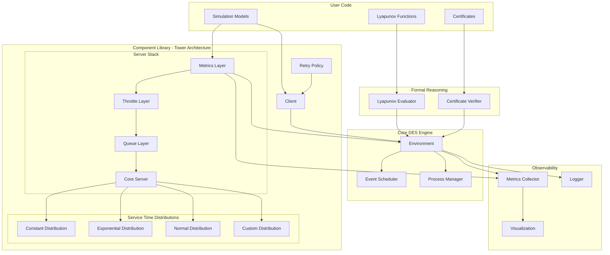

# Design Document

## Overview

The Rust Discrete Event Simulation (DES) Framework is a high-performance, type-safe library for modeling and analyzing distributed systems. The framework consists of three main layers:

1. **Core DES Engine** - Event scheduling, time management, and process execution
2. **Component Library** - Reusable models for servers, clients, queues, throttling, and retry policies
3. **Formal Reasoning Layer** - Lyapunov function evaluation and certificate verification

The design emphasizes zero-cost abstractions, compile-time safety, and extensibility through trait-based interfaces.

## Architecture

### Tower-Inspired Layered Architecture

The server component architecture is inspired by Rust's Tower framework, which provides a modular approach to building network services. The key principles are:

1. **Service Trait**: A core abstraction that maps requests to responses asynchronously
2. **Layers**: Middleware components that wrap services to add cross-cutting functionality
3. **Composability**: Services and layers can be composed together to build complex behavior
4. **Separation of Concerns**: Each layer handles a specific aspect (queuing, throttling, metrics, etc.)

#### Benefits of Tower Architecture

- **Modularity**: Each concern (queuing, throttling, metrics) is implemented as a separate layer
- **Reusability**: Layers can be reused across different server types
- **Testability**: Each layer can be tested in isolation
- **Performance**: Zero-cost abstractions through Rust's type system
- **Extensibility**: New layers can be added without modifying existing code

#### Service Composition Flow

```
Request → MetricsLayer → ThrottleLayer → QueueLayer → CoreServer → Response
```

Each layer can:
- Transform the request/response
- Add side effects (logging, metrics)
- Control flow (throttling, queuing)
- Handle errors and timeouts

### High-Level Architecture



### Module Structure

```
descartes/
├── des-core/          # Core DES engine
│   ├── lib.rs            # Main library exports and Simulation struct
│   ├── scheduler.rs      # Event scheduling and priority queue
│   ├── execute.rs        # Execution strategies and control
│   ├── time.rs           # Simulation time management
│   ├── types.rs          # Core type definitions (EventId, etc.)
│   ├── metrics.rs        # Metrics collection framework
│   ├── error.rs          # Error types and handling
│   ├── dists.rs          # Probability distributions
│   └── formal.rs         # Formal reasoning support
├── des-components/    # Reusable components
│   ├── lib.rs            # Component library exports
│   ├── server.rs         # Server models (legacy)
│   ├── simple_server.rs  # Simple server implementation
│   ├── simple_client.rs  # Simple client implementation
│   ├── client.rs         # Client/generator models
│   ├── queue.rs          # Queue implementations
│   ├── builder.rs        # Builder pattern utilities
│   ├── request.rs        # Request/response types
│   └── error.rs          # Component-specific errors
├── des-metrics/       # Observability
│   ├── lib.rs            # Metrics library
│   └── src/              # Metrics implementations
├── des-viz/           # Visualization
│   ├── lib.rs            # Visualization library
│   └── src/              # Plotting and export
└── target/            # Build artifacts
```

## Components and Interfaces

### Core DES Engine

The core DES engine is built around a component-based architecture with type-safe event handling and efficient scheduling.

#### Simulation Structure

The main simulation container coordinates components and event scheduling:

```rust
/// Main simulation container that coordinates components and scheduling
pub struct Simulation {
    /// Event scheduler for managing timed events
    pub scheduler: Scheduler,
    /// Component container for type-erased components
    pub components: Components,
}

impl Simulation {
    /// Performs one step of the simulation
    /// Returns true if an event was processed, false if simulation ended
    pub fn step(&mut self) -> bool;
    
    /// Runs the entire simulation using the provided executor
    pub fn execute<E: Execute>(&mut self, executor: E);
    
    /// Adds a new component and returns its key
    pub fn add_component<E, C>(&mut self, component: C) -> Key<E>
    where
        E: std::fmt::Debug + 'static,
        C: Component<Event = E> + 'static;
    
    /// Removes a component (typically at simulation end)
    pub fn remove_component<E, C>(&mut self, key: Key<E>) -> Option<C>
    where
        E: std::fmt::Debug + 'static,
        C: Component<Event = E> + 'static;
    
    /// Schedules an event for a component
    pub fn schedule<E>(&mut self, time: SimTime, component: Key<E>, event: E)
    where
        E: std::fmt::Debug + 'static;
}
```

#### Component System

Components are the building blocks of simulations, each handling specific event types:

```rust
/// Core trait for simulation components
pub trait Component: ProcessEventEntry {
    type Event: 'static;

    /// Process an event for this component
    fn process_event(
        &mut self,
        self_id: Key<Self::Event>,
        event: &Self::Event,
        scheduler: &mut Scheduler,
    );
}

/// Type-safe component key for referencing components
pub struct Key<T> {
    id: Uuid,
    _marker: std::marker::PhantomData<T>,
}

/// Container for type-erased components
pub struct Components {
    components: HashMap<Uuid, Box<dyn ProcessEventEntry>>,
}

impl Components {
    /// Register a new component and return its key
    pub fn register<E, C>(&mut self, component: C) -> Key<E>
    where
        E: std::fmt::Debug + 'static,
        C: Component<Event = E> + 'static;
    
    /// Process an event entry on the appropriate component
    pub fn process_event_entry(&mut self, entry: EventEntry, scheduler: &mut Scheduler);
}
```

#### Event Scheduling System

The scheduler manages timed events with efficient priority queue implementation:

```rust
/// Event scheduler with priority queue for timed events
pub struct Scheduler {
    next_event_id: u64,
    events: BinaryHeap<EventEntry>,
    clock: Rc<Cell<SimTime>>,
}

impl Scheduler {
    /// Schedule an event at current time + delay
    pub fn schedule<E>(&mut self, time: SimTime, component: Key<E>, event: E)
    where
        E: std::fmt::Debug + 'static;
    
    /// Schedule an event at current time
    pub fn schedule_now<E>(&mut self, component: Key<E>, event: E)
    where
        E: std::fmt::Debug + 'static;
    
    /// Get current simulation time
    pub fn time(&self) -> SimTime;
    
    /// Get immutable reference to simulation clock
    pub fn clock(&self) -> ClockRef;
    
    /// Peek at next event without removing it
    pub fn peek(&mut self) -> Option<&EventEntry>;
    
    /// Remove and return next event, advancing simulation time
    pub fn pop(&mut self) -> Option<EventEntry>;
}

/// Type-erased event entry for the scheduler
pub struct EventEntry {
    event_id: EventId,
    time: SimTime,
    component: Uuid,
    inner: Box<dyn Any>,
}

impl EventEntry {
    /// Attempt to downcast to typed event entry
    pub fn downcast<E>(&self) -> Option<EventEntryTyped<'_, E>>
    where
        E: std::fmt::Debug + 'static;
}

/// Typed event entry after successful downcast
pub struct EventEntryTyped<'e, E: std::fmt::Debug> {
    pub id: EventId,
    pub time: SimTime,
    pub component_key: Key<E>,
    pub component_idx: Uuid,
    pub event: &'e E,
}
```

#### Simulation Time Management

High-precision time representation with nanosecond accuracy:

```rust
/// Simulation time with nanosecond precision
#[derive(Debug, Clone, Copy, PartialEq, Eq, PartialOrd, Ord)]
pub struct SimTime(u64);

impl SimTime {
    /// Create time at simulation start
    pub const fn zero() -> Self;
    
    /// Create from various time units
    pub const fn from_nanos(nanos: u64) -> Self;
    pub const fn from_micros(micros: u64) -> Self;
    pub const fn from_millis(millis: u64) -> Self;
    pub const fn from_secs(secs: u64) -> Self;
    pub fn from_duration(duration: Duration) -> Self;
    
    /// Convert to standard types
    pub fn as_duration(&self) -> Duration;
    pub const fn as_nanos(&self) -> u64;
    
    /// Time arithmetic
    pub fn duration_since(&self, earlier: SimTime) -> Duration;
    pub fn add_duration(&self, duration: Duration) -> Self;
    pub fn sub_duration(&self, duration: Duration) -> Self;
}

// Arithmetic operations
impl Add<Duration> for SimTime { /* ... */ }
impl Sub<Duration> for SimTime { /* ... */ }
impl Sub<SimTime> for SimTime { /* ... */ }

// Support for floating-point seconds
impl From<f64> for SimTime { /* ... */ }
```

#### Execution Control

Flexible execution strategies for different simulation needs:

```rust
/// Trait for simulation execution strategies
pub trait Execute {
    fn execute(self, sim: &mut Simulation);
}

/// Configurable executor with different stopping conditions
pub struct Executor {
    end_condition: EndCondition,
}

impl Executor {
    /// Run until no events remain
    pub fn unbound() -> Self;
    
    /// Run until specified time limit
    pub fn timed(time: SimTime) -> Self;
    
    /// Run for exact number of steps
    pub fn steps(steps: usize) -> Self;
    
    /// Add side effects after each step
    pub fn side_effect<F>(self, func: F) -> ExecutorWithSideEffect<F>
    where
        F: Fn(&Simulation);
}

/// Executor with custom side effects
pub struct ExecutorWithSideEffect<F>
where
    F: Fn(&Simulation);
```

#### Clock Reference System

Immutable access to simulation time for components:

```rust
/// Immutable reference to simulation clock
pub struct ClockRef {
    clock: Rc<Cell<SimTime>>,
}

impl ClockRef {
    /// Get current simulation time
    pub fn time(&self) -> SimTime;
}
```

### Component Library

All components implement common traits for composability.

#### Component Trait

```rust
pub trait Component: Send {
    fn name(&self) -> &str;
    fn initialize(&mut self, env: &mut Environment) -> Result<(), ComponentError>;
    fn shutdown(&mut self, env: &mut Environment) -> Result<(), ComponentError>;
    fn emit_metrics(&self) -> Vec<Metric>;
}
```

#### Server Component (Tower-Inspired Architecture)

The server component follows Tower's layered service architecture, where a core service is wrapped with middleware layers for cross-cutting concerns like queuing, throttling, and metrics collection.

```rust
/// Core service trait - maps requests to responses
pub trait Service<Request> {
    type Response;
    type Error;
    type Future: Future<Output = Result<Self::Response, Self::Error>>;

    fn poll_ready(&mut self, cx: &mut Context<'_>) -> Poll<Result<(), Self::Error>>;
    fn call(&mut self, req: Request) -> Self::Future;
}

/// Core server service that handles the actual request processing
pub struct CoreServer {
    name: String,
    capacity: usize,
    service_time_dist: Box<dyn ServiceTimeDistribution>,
    active_requests: usize,
    max_capacity: usize,
}

impl Service<RequestAttempt> for CoreServer {
    type Response = Response;
    type Error = RequestError;
    type Future = Pin<Box<dyn Future<Output = Result<Response, RequestError>>>>;

    fn poll_ready(&mut self, _cx: &mut Context<'_>) -> Poll<Result<(), Self::Error>> {
        if self.active_requests < self.capacity {
            Poll::Ready(Ok(()))
        } else {
            Poll::Pending // Service not ready - at capacity
        }
    }

    fn call(&mut self, req: RequestAttempt) -> Self::Future {
        let service_time = self.service_time_dist.sample();
        let start_time = req.started_at;
        let completion_time = start_time + service_time;
        
        self.active_requests += 1;
        
        Box::pin(async move {
            // Simulate service time delay
            delay_until(completion_time).await;
            
            // Create successful response
            Ok(Response::success(
                req.id,
                req.request_id,
                completion_time,
                vec![], // Response payload
            ))
        })
    }
}

/// Layer trait for wrapping services with additional functionality
pub trait Layer<S> {
    type Service;
    
    fn layer(&self, inner: S) -> Self::Service;
}

/// Queue layer that buffers requests when the inner service is not ready
pub struct QueueLayer {
    queue: Box<dyn Queue>,
}

impl<S> Layer<S> for QueueLayer 
where
    S: Service<RequestAttempt>,
{
    type Service = QueueService<S>;
    
    fn layer(&self, inner: S) -> Self::Service {
        QueueService {
            inner,
            queue: self.queue.clone(), // Assuming Clone trait
            pending_requests: VecDeque::new(),
        }
    }
}

pub struct QueueService<S> {
    inner: S,
    queue: Box<dyn Queue>,
    pending_requests: VecDeque<RequestAttempt>,
}

impl<S> Service<RequestAttempt> for QueueService<S>
where
    S: Service<RequestAttempt>,
{
    type Response = S::Response;
    type Error = S::Error;
    type Future = S::Future;

    fn poll_ready(&mut self, cx: &mut Context<'_>) -> Poll<Result<(), Self::Error>> {
        // Always ready to accept requests (will queue if inner service not ready)
        Poll::Ready(Ok(()))
    }

    fn call(&mut self, req: RequestAttempt) -> Self::Future {
        match self.inner.poll_ready(cx) {
            Poll::Ready(Ok(())) => {
                // Inner service is ready, process immediately
                self.inner.call(req)
            }
            Poll::Ready(Err(e)) => {
                // Inner service has an error
                Box::pin(async move { Err(e) })
            }
            Poll::Pending => {
                // Inner service not ready, enqueue the request
                match self.queue.enqueue(QueueItem::new(req, env.now())) {
                    Ok(_) => {
                        // Successfully queued - return pending future
                        Box::pin(async move {
                            // This would be resolved when the request is dequeued and processed
                            Err(RequestError::Queued)
                        })
                    }
                    Err(_) => {
                        // Queue is full
                        Box::pin(async move {
                            Err(RequestError::Rejected("Queue full".to_string()))
                        })
                    }
                }
            }
        }
    }
}

/// Throttle layer that implements rate limiting
pub struct ThrottleLayer {
    throttle: Box<dyn Throttle>,
}

impl<S> Layer<S> for ThrottleLayer 
where
    S: Service<RequestAttempt>,
{
    type Service = ThrottleService<S>;
    
    fn layer(&self, inner: S) -> Self::Service {
        ThrottleService {
            inner,
            throttle: self.throttle.clone(),
        }
    }
}

pub struct ThrottleService<S> {
    inner: S,
    throttle: Box<dyn Throttle>,
}

impl<S> Service<RequestAttempt> for ThrottleService<S>
where
    S: Service<RequestAttempt>,
{
    type Response = S::Response;
    type Error = S::Error;
    type Future = Pin<Box<dyn Future<Output = Result<Self::Response, Self::Error>>>>;

    fn poll_ready(&mut self, cx: &mut Context<'_>) -> Poll<Result<(), Self::Error>> {
        // Check if throttle allows the request
        if self.throttle.can_proceed() {
            self.inner.poll_ready(cx)
        } else {
            Poll::Pending
        }
    }

    fn call(&mut self, req: RequestAttempt) -> Self::Future {
        let inner_future = self.inner.call(req);
        self.throttle.consume_token();
        
        Box::pin(async move {
            inner_future.await
        })
    }
}

/// Metrics layer that collects performance metrics
pub struct MetricsLayer {
    metrics_collector: Arc<MetricsCollector>,
}

impl<S> Layer<S> for MetricsLayer 
where
    S: Service<RequestAttempt>,
{
    type Service = MetricsService<S>;
    
    fn layer(&self, inner: S) -> Self::Service {
        MetricsService {
            inner,
            metrics: self.metrics_collector.clone(),
        }
    }
}

pub struct MetricsService<S> {
    inner: S,
    metrics: Arc<MetricsCollector>,
}

impl<S> Service<RequestAttempt> for MetricsService<S>
where
    S: Service<RequestAttempt>,
{
    type Response = S::Response;
    type Error = S::Error;
    type Future = Pin<Box<dyn Future<Output = Result<Self::Response, Self::Error>>>>;

    fn poll_ready(&mut self, cx: &mut Context<'_>) -> Poll<Result<(), Self::Error>> {
        self.inner.poll_ready(cx)
    }

    fn call(&mut self, req: RequestAttempt) -> Self::Future {
        let start_time = Instant::now();
        let metrics = self.metrics.clone();
        let future = self.inner.call(req);
        
        Box::pin(async move {
            let result = future.await;
            let duration = start_time.elapsed();
            
            // Record metrics based on result
            match &result {
                Ok(_) => {
                    metrics.record_success(duration);
                }
                Err(_) => {
                    metrics.record_error(duration);
                }
            }
            
            result
        })
    }
}

/// Server builder that composes layers
pub struct ServerBuilder {
    core_service: Option<CoreServer>,
    layers: Vec<Box<dyn LayerFn>>,
}

trait LayerFn {
    fn apply(&self, service: Box<dyn Service<RequestAttempt>>) -> Box<dyn Service<RequestAttempt>>;
}

impl ServerBuilder {
    pub fn new() -> Self {
        Self {
            core_service: None,
            layers: Vec::new(),
        }
    }
    
    pub fn core_service(mut self, service: CoreServer) -> Self {
        self.core_service = Some(service);
        self
    }
    
    pub fn layer<L>(mut self, layer: L) -> Self 
    where
        L: Layer<Box<dyn Service<RequestAttempt>>> + 'static,
    {
        self.layers.push(Box::new(move |service| {
            Box::new(layer.layer(service))
        }));
        self
    }
    
    pub fn with_queue(self, queue: Box<dyn Queue>) -> Self {
        self.layer(QueueLayer { queue })
    }
    
    pub fn with_throttle(self, throttle: Box<dyn Throttle>) -> Self {
        self.layer(ThrottleLayer { throttle })
    }
    
    pub fn with_metrics(self, metrics: Arc<MetricsCollector>) -> Self {
        self.layer(MetricsLayer { metrics_collector: metrics })
    }
    
    pub fn build(self) -> Result<Box<dyn Service<RequestAttempt>>, BuildError> {
        let core = self.core_service.ok_or(BuildError::MissingCoreService)?;
        let mut service: Box<dyn Service<RequestAttempt>> = Box::new(core);
        
        // Apply layers in reverse order (outermost layer applied last)
        for layer in self.layers.into_iter().rev() {
            service = layer.apply(service);
        }
        
        Ok(service)
    }
}

/// Pluggable service time distribution trait
pub trait ServiceTimeDistribution: Send + Sync {
    fn sample(&mut self) -> Duration;
    fn mean(&self) -> Duration;
    fn variance(&self) -> Option<Duration>;
}

/// Constant service time distribution
pub struct ConstantServiceTime {
    duration: Duration,
}

impl ConstantServiceTime {
    pub fn new(duration: Duration) -> Self {
        Self { duration }
    }
}

impl ServiceTimeDistribution for ConstantServiceTime {
    fn sample(&mut self) -> Duration {
        self.duration
    }
    
    fn mean(&self) -> Duration {
        self.duration
    }
    
    fn variance(&self) -> Option<Duration> {
        Some(Duration::ZERO)
    }
}

/// Exponential service time distribution
pub struct ExponentialServiceTime {
    rate: f64,
    rng: Box<dyn RngCore>,
}

impl ExponentialServiceTime {
    pub fn new(mean_duration: Duration) -> Self {
        let rate = 1.0 / mean_duration.as_secs_f64();
        Self {
            rate,
            rng: Box::new(thread_rng()),
        }
    }
}

impl ServiceTimeDistribution for ExponentialServiceTime {
    fn sample(&mut self) -> Duration {
        let exp = Exp::new(self.rate).unwrap();
        let sample = exp.sample(&mut *self.rng);
        Duration::from_secs_f64(sample)
    }
    
    fn mean(&self) -> Duration {
        Duration::from_secs_f64(1.0 / self.rate)
    }
    
    fn variance(&self) -> Option<Duration> {
        let var_seconds = 1.0 / (self.rate * self.rate);
        Some(Duration::from_secs_f64(var_seconds))
    }
}

/// Normal (Gaussian) service time distribution
pub struct NormalServiceTime {
    mean: f64,
    std_dev: f64,
    rng: Box<dyn RngCore>,
}

impl NormalServiceTime {
    pub fn new(mean: Duration, std_dev: Duration) -> Self {
        Self {
            mean: mean.as_secs_f64(),
            std_dev: std_dev.as_secs_f64(),
            rng: Box::new(thread_rng()),
        }
    }
}

impl ServiceTimeDistribution for NormalServiceTime {
    fn sample(&mut self) -> Duration {
        let normal = Normal::new(self.mean, self.std_dev).unwrap();
        let sample = normal.sample(&mut *self.rng).max(0.0); // Ensure non-negative
        Duration::from_secs_f64(sample)
    }
    
    fn mean(&self) -> Duration {
        Duration::from_secs_f64(self.mean)
    }
    
    fn variance(&self) -> Option<Duration> {
        let var_seconds = self.std_dev * self.std_dev;
        Some(Duration::from_secs_f64(var_seconds))
    }
}
```

#### Usage Example

```rust
use des_components::server::*;
use des_components::queue::FifoQueue;
use des_components::throttle::TokenBucketThrottle;
use std::time::Duration;

// Create a layered server with queue, throttling, and metrics
let server = ServerBuilder::new()
    .core_service(CoreServer::new(
        "web-server",
        10, // capacity
        Box::new(ExponentialServiceTime::new(Duration::from_millis(50)))
    ))
    .with_queue(Box::new(FifoQueue::bounded(100)))
    .with_throttle(Box::new(TokenBucketThrottle::new(100, Duration::from_secs(1))))
    .with_metrics(metrics_collector)
    .build()?;

// Process a request
let response = server.call(request_attempt).await?;
```
```

#### Client Component

```rust
pub struct Client {
    name: String,
    arrival_pattern: Box<dyn ArrivalPattern>,
    request_generator: Box<dyn RequestGenerator>,
    retry_policy: Option<Box<dyn RetryPolicy>>,
    timeout: Option<Duration>,
}

impl Client {
    pub fn builder() -> ClientBuilder;
    
    /// Send a request with retry and timeout logic
    pub async fn send_request(
        &mut self, 
        env: &mut Environment, 
        target: &mut dyn Component
    ) -> Result<Response, RequestError> {
        let request = self.request_generator.generate();
        env.metrics().start_request(request.clone());
        
        let mut attempt_num = 0;
        loop {
            attempt_num += 1;
            let attempt = RequestAttempt::new(request.id, attempt_num);
            env.metrics().start_attempt(attempt.clone());
            
            // Send attempt with timeout
            let result = match self.timeout {
                Some(timeout) => {
                    timeout_after(env, timeout, target.handle_request(env, attempt.clone())).await
                }
                None => target.handle_request(env, attempt.clone()).await,
            };
            
            match result {
                Ok(response) => {
                    env.metrics().complete_attempt(attempt.id, AttemptStatus::Success);
                    env.metrics().complete_request(request.id, RequestStatus::Success);
                    return Ok(response);
                }
                Err(e) if self.should_retry(attempt_num, &e) => {
                    env.metrics().complete_attempt(attempt.id, AttemptStatus::from_error(&e));
                    let delay = self.retry_policy.as_mut().unwrap().next_delay(attempt_num);
                    delay(env, delay).await;
                    continue;
                }
                Err(e) => {
                    env.metrics().complete_attempt(attempt.id, AttemptStatus::from_error(&e));
                    env.metrics().complete_request(request.id, RequestStatus::Failed { 
                        reason: e.to_string() 
                    });
                    return Err(e);
                }
            }
        }
    }
    
    fn should_retry(&mut self, attempt: usize, error: &RequestError) -> bool {
        self.retry_policy.as_mut()
            .map(|p| p.should_retry(attempt, error))
            .unwrap_or(false)
    }
}

pub trait ArrivalPattern: Send {
    fn next_arrival_time(&mut self) -> Duration;
}

pub trait RequestGenerator: Send {
    fn generate(&mut self) -> Request;
}

// Implementations: Poisson, Constant, Bursty, etc.
```

#### Queue Component

```rust
pub trait Queue: Send {
    fn enqueue(&mut self, item: QueueItem) -> Result<(), QueueError>;
    fn dequeue(&mut self) -> Option<QueueItem>;
    fn len(&self) -> usize;
    fn capacity(&self) -> Option<usize>;
}

pub struct FifoQueue {
    items: VecDeque<QueueItem>,
    capacity: Option<usize>,
}

pub struct PriorityQueue {
    items: BinaryHeap<PrioritizedItem>,
    capacity: Option<usize>,
}
```

#### Throttle Component

```rust
pub struct TokenBucketThrottle {
    capacity: usize,
    tokens: usize,
    refill_rate: f64,
    last_refill: SimTime,
}

impl TokenBucketThrottle {
    pub async fn acquire(&mut self, env: &mut Environment, tokens: usize) -> Result<(), ThrottleError>;
}

pub struct LeakyBucketThrottle {
    capacity: usize,
    leak_rate: f64,
    current_level: f64,
}
```

#### Retry Policy Component

```rust
pub trait RetryPolicy: Send {
    fn should_retry(&mut self, attempt: usize, error: &Error) -> bool;
    fn next_delay(&mut self, attempt: usize) -> Duration;
}

pub struct ExponentialBackoff {
    base_delay: Duration,
    max_delay: Duration,
    multiplier: f64,
    jitter: bool,
}

pub struct CircuitBreaker {
    failure_threshold: usize,
    timeout: Duration,
    state: CircuitState,
}

enum CircuitState {
    Closed,
    Open { opened_at: SimTime },
    HalfOpen,
}
```

### Formal Reasoning Layer

#### Lyapunov Function Support

```rust
pub trait LyapunovFunction: Send {
    fn evaluate(&self, state: &SimulationState) -> f64;
    fn drift_bound(&self) -> f64;
}

pub struct LyapunovEvaluator {
    functions: Vec<Box<dyn LyapunovFunction>>,
    history: Vec<LyapunovSample>,
}

impl LyapunovEvaluator {
    pub fn add_function(&mut self, func: Box<dyn LyapunovFunction>);
    pub fn evaluate_step(&mut self, state: &SimulationState) -> Result<(), LyapunovViolation>;
    pub fn get_history(&self) -> &[LyapunovSample];
}

pub struct LyapunovSample {
    time: SimTime,
    value: f64,
    drift: f64,
}
```

#### Certificate Verification

```rust
pub trait Certificate: Send {
    fn name(&self) -> &str;
    fn check(&self, state: &SimulationState) -> CertificateResult;
}

pub enum CertificateResult {
    Satisfied,
    Violated { reason: String, counterexample: SimulationState },
}

pub struct CertificateVerifier {
    certificates: Vec<Box<dyn Certificate>>,
    violations: Vec<Violation>,
}

// Example certificate types
pub struct LatencyBoundCertificate {
    max_latency: Duration,
    percentile: f64,
}

pub struct StabilityInvariant {
    queue_bound: usize,
}
```

### Observability Layer

#### Metrics Collection

```rust
pub struct MetricsCollector {
    backend: Box<dyn MetricsBackend>,
    metrics: HashMap<String, MetricSeries>,
    request_tracker: RequestTracker,
}

pub trait MetricsBackend: Send {
    fn record(&mut self, metric: Metric);
    fn flush(&mut self) -> Result<(), MetricsError>;
}

pub enum Metric {
    Counter { name: String, value: u64, time: SimTime },
    Gauge { name: String, value: f64, time: SimTime },
    Histogram { name: String, value: f64, time: SimTime },
}

pub struct MetricSeries {
    name: String,
    samples: Vec<Sample>,
}

impl MetricSeries {
    pub fn mean(&self) -> f64;
    pub fn percentile(&self, p: f64) -> f64;
    pub fn variance(&self) -> f64;
}

/// Tracks requests and attempts for computing end-to-end metrics
pub struct RequestTracker {
    active_requests: HashMap<RequestId, Request>,
    completed_requests: Vec<Request>,
    active_attempts: HashMap<RequestAttemptId, RequestAttempt>,
    completed_attempts: Vec<RequestAttempt>,
}

impl RequestTracker {
    /// Record a new request being created
    pub fn start_request(&mut self, request: Request);
    
    /// Record a new attempt for a request
    pub fn start_attempt(&mut self, attempt: RequestAttempt);
    
    /// Record attempt completion
    pub fn complete_attempt(&mut self, attempt_id: RequestAttemptId, status: AttemptStatus);
    
    /// Record request completion (success or failure)
    pub fn complete_request(&mut self, request_id: RequestId, status: RequestStatus);
    
    /// Compute end-to-end latency (request creation to completion)
    pub fn request_latency_stats(&self) -> LatencyStats;
    
    /// Compute per-attempt latency
    pub fn attempt_latency_stats(&self) -> LatencyStats;
    
    /// Compute goodput (successful requests / total time)
    pub fn goodput(&self, time_window: Duration) -> f64;
    
    /// Compute throughput (all attempts / total time)
    pub fn throughput(&self, time_window: Duration) -> f64;
    
    /// Compute retry rate
    pub fn retry_rate(&self) -> f64;
    
    /// Compute timeout rate
    pub fn timeout_rate(&self) -> f64;
}

pub struct LatencyStats {
    pub mean: Duration,
    pub median: Duration,
    pub p50: Duration,
    pub p95: Duration,
    pub p99: Duration,
    pub p999: Duration,
    pub min: Duration,
    pub max: Duration,
}
```

#### Structured Logging

```rust
pub struct Logger {
    level: LogLevel,
    backend: Box<dyn LogBackend>,
}

pub trait LogBackend: Send {
    fn log(&mut self, entry: LogEntry);
}

pub struct LogEntry {
    time: SimTime,
    level: LogLevel,
    component: String,
    message: String,
    context: HashMap<String, String>,
}
```

#### Visualization

```rust
pub struct Visualizer {
    backend: Box<dyn PlotBackend>,
}

pub trait PlotBackend: Send {
    fn create_time_series(&mut self, data: &MetricSeries) -> Plot;
    fn create_histogram(&mut self, data: &[f64]) -> Plot;
    fn export(&self, plot: &Plot, format: ExportFormat) -> Result<Vec<u8>, VizError>;
}

pub enum ExportFormat {
    Png,
    Svg,
    Html,
}

// Use plotters crate as default backend
pub struct PlottersBackend {
    // Lightweight plotting using plotters
}
```

## Data Models

### Simulation State

```rust
pub struct SimulationState {
    time: SimTime,
    components: HashMap<ComponentId, ComponentState>,
    metrics: MetricsSnapshot,
}

pub struct ComponentState {
    component_id: ComponentId,
    state_data: Box<dyn Any + Send>,
}
```

### Time Representation

```rust
#[derive(Debug, Clone, Copy, PartialEq, Eq, PartialOrd, Ord)]
pub struct SimTime(f64); // make time a float so that we can directly sample from a continuous distribution

impl SimTime {
    pub fn from_duration(d: Duration) -> Self;
    pub fn as_duration(&self) -> Duration;
    pub fn add(&self, d: Duration) -> Self;
}
```

### Request/Response Model

The framework distinguishes between logical requests (from the client's perspective) and individual request attempts (actual network/server interactions).

```rust
/// A logical request from a client - may involve multiple attempts
pub struct Request {
    id: RequestId,
    created_at: SimTime,
    payload: Vec<u8>,
    trace_context: TraceContext,
    attempts: Vec<RequestAttemptId>,
    completed_at: Option<SimTime>,
    final_status: Option<RequestStatus>,
}

impl Request {
    pub fn latency(&self) -> Option<Duration> {
        self.completed_at.map(|t| t.duration_since(self.created_at))
    }
    
    pub fn attempt_count(&self) -> usize {
        self.attempts.len()
    }
}

/// A single attempt to fulfill a request - may timeout or fail
pub struct RequestAttempt {
    id: RequestAttemptId,
    request_id: RequestId,
    attempt_number: usize,
    started_at: SimTime,
    completed_at: Option<SimTime>,
    status: AttemptStatus,
    payload: Vec<u8>,
}

impl RequestAttempt {
    pub fn duration(&self) -> Option<Duration> {
        self.completed_at.map(|t| t.duration_since(self.started_at))
    }
}

pub enum AttemptStatus {
    Pending,
    Success,
    Timeout,
    ServerError,
    Rejected,
}

pub enum RequestStatus {
    Success,
    Failed { reason: String },
    Exhausted, // All retries exhausted
}

pub struct Response {
    attempt_id: RequestAttemptId,
    request_id: RequestId,
    completed_at: SimTime,
    payload: Vec<u8>,
    status: ResponseStatus,
}

pub enum ResponseStatus {
    Ok,
    Error { code: u32, message: String },
}
```

## Error Handling

The framework uses a hierarchical error type system:

```rust
#[derive(Debug, thiserror::Error)]
pub enum SimError {
    #[error("Event error: {0}")]
    Event(#[from] EventError),
    
    #[error("Component error: {0}")]
    Component(#[from] ComponentError),
    
    #[error("Formal verification failed: {0}")]
    Verification(#[from] VerificationError),
    
    #[error("Metrics error: {0}")]
    Metrics(#[from] MetricsError),
}

// Specific error types for each subsystem
#[derive(Debug, thiserror::Error)]
pub enum EventError {
    #[error("Invalid event time")]
    InvalidTime,
    
    #[error("Event handler failed: {0}")]
    HandlerFailed(String),
}
```

## Testing Strategy

### Unit Testing

- Test each component in isolation with mock environments
- Property-based testing using `proptest` for invariant checking
- Test Lyapunov function evaluation with known stable/unstable systems

### Integration Testing

- Build small simulation scenarios combining multiple components
- Verify metrics collection accuracy
- Test certificate violation detection

### Performance Testing

- Benchmark event scheduling overhead
- Measure memory usage for large simulations
- Profile hot paths and optimize

### Formal Verification Testing

- Create test cases with known Lyapunov functions
- Verify certificate checking with intentional violations
- Test edge cases in formal reasoning logic

## Dependencies

Core dependencies:
- `tokio` or custom async runtime for process support
- `priority-queue` or `binary-heap-plus` for event scheduling
- `rand` and `rand_distr` for probability distributions
- `thiserror` for error handling
- `tracing` for structured logging
- `plotters` for lightweight visualization
- `serde` for serialization support

Optional dependencies:
- `proptest` for property-based testing
- `criterion` for benchmarking

## Performance Considerations

1. **Zero-cost abstractions**: Use trait objects only where dynamic dispatch is necessary
2. **Memory pooling**: Reuse event and request objects to reduce allocations
3. **Batch processing**: Process multiple events at the same time when possible
4. **Lazy evaluation**: Defer metric calculations until requested
5. **Compile-time optimization**: Use const generics and monomorphization where beneficial

## Extensibility Points

1. **Custom components**: Implement `Component` trait
2. **Custom events**: Implement `EventHandler` trait
3. **Custom metrics backends**: Implement `MetricsBackend` trait
4. **Custom distributions**: Implement `Distribution` trait
5. **Custom formal reasoning**: Implement `FormalVerifier` trait
6. **Custom visualization**: Implement `PlotBackend` trait
