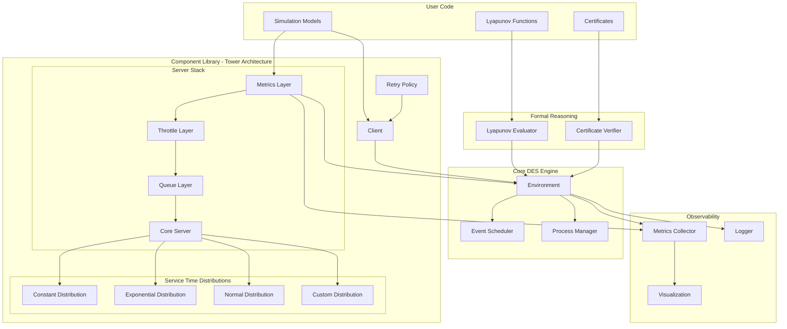

# Design Document

## Overview

The Rust Discrete Event Simulation (DES) Framework is a high-performance, type-safe library for modeling and analyzing distributed systems. The framework consists of three main layers:

1. **Core DES Engine** - Event scheduling, time management, and process execution with SimPy-like semantics
2. **Component Library** - Reusable models for servers, clients, queues, throttling, and retry policies
3. **Formal Reasoning Layer** - Lyapunov function evaluation and certificate verification

The design emphasizes zero-cost abstractions, compile-time safety, and extensibility through trait-based interfaces while providing familiar SimPy-like process semantics for ease of use.

### SimPy-Like Process Model

The framework provides a SimPy-inspired process model where simulation entities are implemented as async functions that can yield control and be resumed:

```rust
use des_core::{Simulation, process};
use std::time::Duration;

// Example: A simple client process that sends requests periodically
async fn client_process(server_id: ComponentKey) {
    for i in 0..10 {
        // Send request
        let request = Request::new(i);
        send_request(server_id, request).await;
        
        // Wait before next request (yields control to other processes)
        process::delay(Duration::from_millis(100)).await;
    }
}

// Example: A server process that handles requests
async fn server_process() {
    loop {
        // Wait for incoming request (yields until request arrives)
        let request = wait_for_request().await;
        
        // Process request (simulated service time)
        let service_time = sample_service_time();
        process::delay(service_time).await;
        
        // Send response
        send_response(request.id, "OK").await;
    }
}

// Usage in simulation
fn main() {
    let mut sim = Simulation::default();
    
    // Spawn processes (similar to SimPy's env.process())
    sim.spawn(client_process(server_key));
    sim.spawn(server_process());
    
    // Run simulation
    sim.run_until(SimTime::from_secs(10));
}
```

## Architecture

### Tower-Inspired Layered Architecture

The server component architecture is inspired by Rust's Tower framework, which provides a modular approach to building network services. The key principles are:

1. **Service Trait**: A core abstraction that maps requests to responses asynchronously
2. **Layers**: Middleware components that wrap services to add cross-cutting functionality
3. **Composability**: Services and layers can be composed together to build complex behavior
4. **Separation of Concerns**: Each layer handles a specific aspect (queuing, throttling, metrics, etc.)

#### Benefits of Tower Architecture

- **Modularity**: Each concern (queuing, throttling, metrics) is implemented as a separate layer
- **Reusability**: Layers can be reused across different server types
- **Testability**: Each layer can be tested in isolation
- **Performance**: Zero-cost abstractions through Rust's type system
- **Extensibility**: New layers can be added without modifying existing code

#### Service Composition Flow

```
Request → MetricsLayer → ThrottleLayer → QueueLayer → CoreServer → Response
```

Each layer can:
- Transform the request/response
- Add side effects (logging, metrics)
- Control flow (throttling, queuing)
- Handle errors and timeouts

### High-Level Architecture



### Module Structure

```
descartes/
├── des-core/          # Core DES engine
│   ├── lib.rs            # Main library exports and Simulation struct
│   ├── scheduler.rs      # Event scheduling and priority queue
│   ├── execute.rs        # Execution strategies and control
│   ├── time.rs           # Simulation time management
│   ├── types.rs          # Core type definitions (EventId, etc.)
│   ├── metrics.rs        # Metrics collection framework
│   ├── error.rs          # Error types and handling
│   ├── dists.rs          # Probability distributions
│   └── formal.rs         # Formal reasoning support
├── des-components/    # Reusable components
│   ├── lib.rs            # Component library exports
│   ├── server.rs         # Server models (legacy)
│   ├── simple_server.rs  # Simple server implementation
│   ├── simple_client.rs  # Simple client implementation
│   ├── client.rs         # Client/generator models
│   ├── queue.rs          # Queue implementations
│   ├── builder.rs        # Builder pattern utilities
│   ├── request.rs        # Request/response types
│   └── error.rs          # Component-specific errors
├── des-metrics/       # Observability
│   ├── lib.rs            # Metrics library
│   └── src/              # Metrics implementations
├── des-viz/           # Visualization
│   ├── lib.rs            # Visualization library
│   └── src/              # Plotting and export
└── target/            # Build artifacts
```

## Components and Interfaces

### Core DES Engine

The core DES engine is built around a component-based architecture with type-safe event handling and efficient scheduling. The main coordination happens through the `Simulation` struct (which serves as the "Environment" mentioned in requirements), providing SimPy-like functionality for process management and event scheduling.

#### Simulation Structure (Environment)

The main simulation container coordinates components and event scheduling, serving as the central "Environment" that manages simulation time progression:

```rust
/// Main simulation container that coordinates components and scheduling
/// This serves as the "Environment" component mentioned in requirements
pub struct Simulation {
    /// Event scheduler for managing timed events
    pub scheduler: Scheduler,
    /// Component container for type-erased components
    pub components: Components,
    /// Async runtime for process management
    pub runtime: DesRuntime,
}

impl Simulation {
    /// Performs one step of the simulation
    /// Returns true if an event was processed, false if simulation ended
    pub fn step(&mut self) -> bool;
    
    /// Runs the entire simulation using the provided executor
    pub fn execute<E: Execute>(&mut self, executor: E);
    
    /// Adds a new component and returns its key
    pub fn add_component<E, C>(&mut self, component: C) -> Key<E>
    where
        E: std::fmt::Debug + 'static,
        C: Component<Event = E> + 'static;
    
    /// Removes a component (typically at simulation end)
    pub fn remove_component<E, C>(&mut self, key: Key<E>) -> Option<C>
    where
        E: std::fmt::Debug + 'static,
        C: Component<Event = E> + 'static;
    
    /// Schedules an event for a component
    pub fn schedule<E>(&mut self, time: SimTime, component: Key<E>, event: E)
    where
        E: std::fmt::Debug + 'static;
    
    /// Spawn a process (coroutine) that can yield and be resumed
    pub fn spawn<F>(&mut self, process: F)
    where
        F: Future<Output = ()> + Send + 'static;
    
    /// Current simulation time
    pub fn now(&self) -> SimTime;
}
```

#### Process Management

The framework provides SimPy-like process management through the async runtime, allowing processes to yield control and be resumed:

```rust
/// Process management functions available to simulation processes
pub mod process {
    use des_core::{SimTime, async_runtime::sim_sleep};
    use std::time::Duration;
    
    /// Suspend the current process for the specified duration
    /// The process will be resumed at current_time + delay
    pub async fn delay(duration: Duration) {
        sim_sleep(duration).await;
    }
    
    /// Suspend the current process until the specified absolute time
    pub async fn delay_until(time: SimTime) {
        let current = current_sim_time().unwrap_or_default();
        if time > current {
            let duration = time.duration_since(current);
            sim_sleep(duration).await;
        }
    }
    
    /// Wait for an event to occur (implemented via channels)
    pub async fn wait_for_event<T>(receiver: &mut Receiver<T>) -> T {
        receiver.recv().await.unwrap()
    }
    
    /// Get current simulation time from within a process
    pub fn current_time() -> SimTime {
        current_sim_time().unwrap_or_default()
    }
}

/// Example process that demonstrates yielding and resumption
async fn example_process() {
    println!("Process starting at time: {:?}", process::current_time());
    
    // Yield control for 100ms of simulation time
    process::delay(Duration::from_millis(100)).await;
    
    println!("Process resumed at time: {:?}", process::current_time());
    
    // Wait until specific time
    process::delay_until(SimTime::from_secs(5)).await;
    
    println!("Process finished at time: {:?}", process::current_time());
}
```
```

#### Component System

Components are the building blocks of simulations, each handling specific event types:

```rust
/// Core trait for simulation components
pub trait Component: ProcessEventEntry {
    type Event: 'static;

    /// Process an event for this component
    fn process_event(
        &mut self,
        self_id: Key<Self::Event>,
        event: &Self::Event,
        scheduler: &mut Scheduler,
    );
}

/// Type-safe component key for referencing components
pub struct Key<T> {
    id: Uuid,
    _marker: std::marker::PhantomData<T>,
}

/// Container for type-erased components
pub struct Components {
    components: HashMap<Uuid, Box<dyn ProcessEventEntry>>,
}

impl Components {
    /// Register a new component and return its key
    pub fn register<E, C>(&mut self, component: C) -> Key<E>
    where
        E: std::fmt::Debug + 'static,
        C: Component<Event = E> + 'static;
    
    /// Process an event entry on the appropriate component
    pub fn process_event_entry(&mut self, entry: EventEntry, scheduler: &mut Scheduler);
}
```

#### Event Scheduling System

The scheduler manages timed events with efficient priority queue implementation:

```rust
/// Event scheduler with priority queue for timed events
pub struct Scheduler {
    next_event_id: u64,
    events: BinaryHeap<EventEntry>,
    clock: Rc<Cell<SimTime>>,
}

impl Scheduler {
    /// Schedule an event at current time + delay
    pub fn schedule<E>(&mut self, time: SimTime, component: Key<E>, event: E)
    where
        E: std::fmt::Debug + 'static;
    
    /// Schedule an event at current time
    pub fn schedule_now<E>(&mut self, component: Key<E>, event: E)
    where
        E: std::fmt::Debug + 'static;
    
    /// Get current simulation time
    pub fn time(&self) -> SimTime;
    
    /// Get immutable reference to simulation clock
    pub fn clock(&self) -> ClockRef;
    
    /// Peek at next event without removing it
    pub fn peek(&mut self) -> Option<&EventEntry>;
    
    /// Remove and return next event, advancing simulation time
    pub fn pop(&mut self) -> Option<EventEntry>;
}

/// Type-erased event entry for the scheduler
pub struct EventEntry {
    event_id: EventId,
    time: SimTime,
    component: Uuid,
    inner: Box<dyn Any>,
}

impl EventEntry {
    /// Attempt to downcast to typed event entry
    pub fn downcast<E>(&self) -> Option<EventEntryTyped<'_, E>>
    where
        E: std::fmt::Debug + 'static;
}

/// Typed event entry after successful downcast
pub struct EventEntryTyped<'e, E: std::fmt::Debug> {
    pub id: EventId,
    pub time: SimTime,
    pub component_key: Key<E>,
    pub component_idx: Uuid,
    pub event: &'e E,
}
```

#### Simulation Time Management

High-precision time representation with nanosecond accuracy:

```rust
/// Simulation time with nanosecond precision
#[derive(Debug, Clone, Copy, PartialEq, Eq, PartialOrd, Ord)]
pub struct SimTime(u64);

impl SimTime {
    /// Create time at simulation start
    pub const fn zero() -> Self;
    
    /// Create from various time units
    pub const fn from_nanos(nanos: u64) -> Self;
    pub const fn from_micros(micros: u64) -> Self;
    pub const fn from_millis(millis: u64) -> Self;
    pub const fn from_secs(secs: u64) -> Self;
    pub fn from_duration(duration: Duration) -> Self;
    
    /// Convert to standard types
    pub fn as_duration(&self) -> Duration;
    pub const fn as_nanos(&self) -> u64;
    
    /// Time arithmetic
    pub fn duration_since(&self, earlier: SimTime) -> Duration;
    pub fn add_duration(&self, duration: Duration) -> Self;
    pub fn sub_duration(&self, duration: Duration) -> Self;
}

// Arithmetic operations
impl Add<Duration> for SimTime { /* ... */ }
impl Sub<Duration> for SimTime { /* ... */ }
impl Sub<SimTime> for SimTime { /* ... */ }

// Support for floating-point seconds
impl From<f64> for SimTime { /* ... */ }
```

#### Execution Control

Flexible execution strategies for different simulation needs:

```rust
/// Trait for simulation execution strategies
pub trait Execute {
    fn execute(self, sim: &mut Simulation);
}

/// Configurable executor with different stopping conditions
pub struct Executor {
    end_condition: EndCondition,
}

impl Executor {
    /// Run until no events remain
    pub fn unbound() -> Self;
    
    /// Run until specified time limit
    pub fn timed(time: SimTime) -> Self;
    
    /// Run for exact number of steps
    pub fn steps(steps: usize) -> Self;
    
    /// Add side effects after each step
    pub fn side_effect<F>(self, func: F) -> ExecutorWithSideEffect<F>
    where
        F: Fn(&Simulation);
}

/// Executor with custom side effects
pub struct ExecutorWithSideEffect<F>
where
    F: Fn(&Simulation);
```

#### Clock Reference System

Immutable access to simulation time for components:

```rust
/// Immutable reference to simulation clock
pub struct ClockRef {
    clock: Rc<Cell<SimTime>>,
}

impl ClockRef {
    /// Get current simulation time
    pub fn time(&self) -> SimTime;
}
```


#### Server Component (DES-Based Layered Architecture)

The server component uses a layered architecture inspired by Tower's concepts but adapted for discrete event simulation. All operations go through the DES scheduler rather than using async/await.

```rust
/// Server events that flow through the DES scheduler
#[derive(Debug)]
pub enum ServerEvent {
    /// Request received from client
    ProcessRequest { 
        request_id: RequestId, 
        client_id: Key<ClientEvent>,
        payload: Vec<u8>,
    },
    /// Request processing completed
    RequestCompleted { 
        request_id: RequestId, 
        client_id: Key<ClientEvent>,
        success: bool,
    },
    /// Process queued requests (triggered when capacity becomes available)
    ProcessQueue,
}

/// Core server component that handles request processing
pub struct Server {
    name: String,
    capacity: usize,
    service_time_dist: Box<dyn ServiceTimeDistribution>,
    active_requests: usize,
    
    // Layered functionality
    queue: Option<Box<dyn Queue>>,
    throttle: Option<Box<dyn Throttle>>,
    metrics: SimulationMetrics,
    
    // State tracking
    total_processed: u64,
    total_rejected: u64,
}

impl Component for Server {
    type Event = ServerEvent;

    fn process_event(
        &mut self,
        self_id: Key<Self::Event>,
        event: &Self::Event,
        scheduler: &mut Scheduler,
    ) {
        match event {
            ServerEvent::ProcessRequest { request_id, client_id, payload } => {
                self.handle_request(*request_id, *client_id, payload.clone(), self_id, scheduler);
            }
            ServerEvent::RequestCompleted { request_id, client_id, success } => {
                self.complete_request(*request_id, *client_id, *success, self_id, scheduler);
            }
            ServerEvent::ProcessQueue => {
                self.process_queued_requests(self_id, scheduler);
            }
        }
    }
}

impl Server {
    /// Handle incoming request with layered processing
    fn handle_request(
        &mut self,
        request_id: RequestId,
        client_id: Key<ClientEvent>,
        payload: Vec<u8>,
        self_id: Key<ServerEvent>,
        scheduler: &mut Scheduler,
    ) {
        // Layer 1: Throttling check
        if let Some(ref mut throttle) = self.throttle {
            if !throttle.can_proceed(scheduler.time()) {
                self.reject_request(request_id, client_id, "Rate limited", scheduler);
                return;
            }
        }

        // Layer 2: Capacity check
        if self.active_requests >= self.capacity {
            // Layer 3: Queue if available
            if let Some(ref mut queue) = self.queue {
                let queue_item = QueueItem::new(request_id, client_id, payload, scheduler.time());
                match queue.enqueue(queue_item) {
                    Ok(_) => {
                        self.metrics.increment_counter("requests_queued", &self.name, scheduler.time());
                        return; // Successfully queued
                    }
                    Err(_) => {
                        self.reject_request(request_id, client_id, "Queue full", scheduler);
                        return;
                    }
                }
            } else {
                self.reject_request(request_id, client_id, "Server at capacity", scheduler);
                return;
            }
        }

        // Layer 4: Core processing
        self.start_processing(request_id, client_id, self_id, scheduler);
    }

    /// Start processing a request (core server functionality)
    fn start_processing(
        &mut self,
        request_id: RequestId,
        client_id: Key<ClientEvent>,
        self_id: Key<ServerEvent>,
        scheduler: &mut Scheduler,
    ) {
        // Sample service time from distribution
        let service_time = self.service_time_dist.sample();
        
        // Update state
        self.active_requests += 1;
        
        // Record metrics
        self.metrics.increment_counter("requests_accepted", &self.name, scheduler.time());
        self.metrics.record_gauge("active_requests", &self.name, self.active_requests as f64, scheduler.time());
        self.metrics.record_duration("service_time", &self.name, service_time, scheduler.time());
        
        // Schedule completion event through DES scheduler
        scheduler.schedule(
            SimTime::from_duration(service_time),
            self_id,
            ServerEvent::RequestCompleted {
                request_id,
                client_id,
                success: true,
            },
        );
    }

    /// Complete request processing
    fn complete_request(
        &mut self,
        request_id: RequestId,
        client_id: Key<ClientEvent>,
        success: bool,
        self_id: Key<ServerEvent>,
        scheduler: &mut Scheduler,
    ) {
        // Update state
        self.active_requests = self.active_requests.saturating_sub(1);
        if success {
            self.total_processed += 1;
        }
        
        // Record metrics
        self.metrics.increment_counter("requests_completed", &self.name, scheduler.time());
        self.metrics.record_gauge("active_requests", &self.name, self.active_requests as f64, scheduler.time());
        
        // Send response to client through DES scheduler
        scheduler.schedule_now(
            client_id,
            ClientEvent::ResponseReceived { success },
        );
        
        // Process queued requests if any
        if self.queue.as_ref().map(|q| !q.is_empty()).unwrap_or(false) {
            scheduler.schedule_now(self_id, ServerEvent::ProcessQueue);
        }
    }

    /// Process queued requests when capacity becomes available
    fn process_queued_requests(
        &mut self,
        self_id: Key<ServerEvent>,
        scheduler: &mut Scheduler,
    ) {
        while self.active_requests < self.capacity {
            if let Some(ref mut queue) = self.queue {
                if let Some(queued_item) = queue.dequeue() {
                    self.start_processing(
                        queued_item.request_id,
                        queued_item.client_id,
                        self_id,
                        scheduler,
                    );
                } else {
                    break; // Queue is empty
                }
            } else {
                break; // No queue
            }
        }
    }

    /// Reject a request and notify client
    fn reject_request(
        &mut self,
        request_id: RequestId,
        client_id: Key<ClientEvent>,
        reason: &str,
        scheduler: &mut Scheduler,
    ) {
        self.total_rejected += 1;
        self.metrics.increment_counter("requests_rejected", &self.name, scheduler.time());
        
        // Send rejection to client through DES scheduler
        scheduler.schedule_now(
            client_id,
            ClientEvent::ResponseReceived { success: false },
        );
    }
}

/// Builder for constructing layered servers
pub struct ServerBuilder {
    name: Option<String>,
    capacity: Option<usize>,
    service_time_dist: Option<Box<dyn ServiceTimeDistribution>>,
    queue: Option<Box<dyn Queue>>,
    throttle: Option<Box<dyn Throttle>>,
}

impl ServerBuilder {
    pub fn new() -> Self {
        Self {
            name: None,
            capacity: None,
            service_time_dist: None,
            queue: None,
            throttle: None,
        }
    }
    
    pub fn name(mut self, name: impl Into<String>) -> Self {
        self.name = Some(name.into());
        self
    }
    
    pub fn capacity(mut self, capacity: usize) -> Self {
        self.capacity = Some(capacity);
        self
    }
    
    pub fn service_time(mut self, dist: Box<dyn ServiceTimeDistribution>) -> Self {
        self.service_time_dist = Some(dist);
        self
    }
    
    pub fn with_queue(mut self, queue: Box<dyn Queue>) -> Self {
        self.queue = Some(queue);
        self
    }
    
    pub fn with_throttle(mut self, throttle: Box<dyn Throttle>) -> Self {
        self.throttle = Some(throttle);
        self
    }
    
    pub fn build(self) -> Result<Server, BuildError> {
        Ok(Server {
            name: self.name.ok_or(BuildError::MissingName)?,
            capacity: self.capacity.ok_or(BuildError::MissingCapacity)?,
            service_time_dist: self.service_time_dist.ok_or(BuildError::MissingServiceTime)?,
            active_requests: 0,
            queue: self.queue,
            throttle: self.throttle,
            metrics: SimulationMetrics::new(),
            total_processed: 0,
            total_rejected: 0,
        })
    }
}
/// Pluggable service time distribution trait
pub trait ServiceTimeDistribution: Send + Sync {
    fn sample(&mut self) -> Duration;
    fn mean(&self) -> Duration;
    fn variance(&self) -> Option<Duration>;
}

/// Constant service time distribution
pub struct ConstantServiceTime {
    duration: Duration,
}

impl ConstantServiceTime {
    pub fn new(duration: Duration) -> Self {
        Self { duration }
    }
}

impl ServiceTimeDistribution for ConstantServiceTime {
    fn sample(&mut self) -> Duration {
        self.duration
    }
    
    fn mean(&self) -> Duration {
        self.duration
    }
    
    fn variance(&self) -> Option<Duration> {
        Some(Duration::ZERO)
    }
}

/// Exponential service time distribution
pub struct ExponentialServiceTime {
    rate: f64,
    rng: Box<dyn RngCore>,
}

impl ExponentialServiceTime {
    pub fn new(mean_duration: Duration) -> Self {
        let rate = 1.0 / mean_duration.as_secs_f64();
        Self {
            rate,
            rng: Box::new(thread_rng()),
        }
    }
}

impl ServiceTimeDistribution for ExponentialServiceTime {
    fn sample(&mut self) -> Duration {
        let exp = Exp::new(self.rate).unwrap();
        let sample = exp.sample(&mut *self.rng);
        Duration::from_secs_f64(sample)
    }
    
    fn mean(&self) -> Duration {
        Duration::from_secs_f64(1.0 / self.rate)
    }
    
    fn variance(&self) -> Option<Duration> {
        let var_seconds = 1.0 / (self.rate * self.rate);
        Some(Duration::from_secs_f64(var_seconds))
    }
}

/// Normal (Gaussian) service time distribution
pub struct NormalServiceTime {
    mean: f64,
    std_dev: f64,
    rng: Box<dyn RngCore>,
}

impl NormalServiceTime {
    pub fn new(mean: Duration, std_dev: Duration) -> Self {
        Self {
            mean: mean.as_secs_f64(),
            std_dev: std_dev.as_secs_f64(),
            rng: Box::new(thread_rng()),
        }
    }
}

impl ServiceTimeDistribution for NormalServiceTime {
    fn sample(&mut self) -> Duration {
        let normal = Normal::new(self.mean, self.std_dev).unwrap();
        let sample = normal.sample(&mut *self.rng).max(0.0); // Ensure non-negative
        Duration::from_secs_f64(sample)
    }
    
    fn mean(&self) -> Duration {
        Duration::from_secs_f64(self.mean)
    }
    
    fn variance(&self) -> Option<Duration> {
        let var_seconds = self.std_dev * self.std_dev;
        Some(Duration::from_secs_f64(var_seconds))
    }
}
    }
}

/// Server builder that composes layers
pub struct ServerBuilder {
    core_service: Option<CoreServer>,
    layers: Vec<Box<dyn LayerFn>>,
}

trait LayerFn {
    fn apply(&self, service: Box<dyn Service<RequestAttempt>>) -> Box<dyn Service<RequestAttempt>>;
}

impl ServerBuilder {
    pub fn new() -> Self {
        Self {
            core_service: None,
            layers: Vec::new(),
        }
    }
    
    pub fn core_service(mut self, service: CoreServer) -> Self {
        self.core_service = Some(service);
        self
    }
    
    pub fn layer<L>(mut self, layer: L) -> Self 
    where
        L: Layer<Box<dyn Service<RequestAttempt>>> + 'static,
    {
        self.layers.push(Box::new(move |service| {
            Box::new(layer.layer(service))
        }));
        self
    }
    
    pub fn with_queue(self, queue: Box<dyn Queue>) -> Self {
        self.layer(QueueLayer { queue })
    }
    
    pub fn with_throttle(self, throttle: Box<dyn Throttle>) -> Self {
        self.layer(ThrottleLayer { throttle })
    }
    
    pub fn with_metrics(self, metrics: Arc<MetricsCollector>) -> Self {
        self.layer(MetricsLayer { metrics_collector: metrics })
    }
    
    pub fn build(self) -> Result<Box<dyn Service<RequestAttempt>>, BuildError> {
        let core = self.core_service.ok_or(BuildError::MissingCoreService)?;
        let mut service: Box<dyn Service<RequestAttempt>> = Box::new(core);
        
        // Apply layers in reverse order (outermost layer applied last)
        for layer in self.layers.into_iter().rev() {
            service = layer.apply(service);
        }
        
        Ok(service)
    }
}

/// Pluggable service time distribution trait
pub trait ServiceTimeDistribution: Send + Sync {
    fn sample(&mut self) -> Duration;
    fn mean(&self) -> Duration;
    fn variance(&self) -> Option<Duration>;
}

/// Constant service time distribution
pub struct ConstantServiceTime {
    duration: Duration,
}

impl ConstantServiceTime {
    pub fn new(duration: Duration) -> Self {
        Self { duration }
    }
}

impl ServiceTimeDistribution for ConstantServiceTime {
    fn sample(&mut self) -> Duration {
        self.duration
    }
    
    fn mean(&self) -> Duration {
        self.duration
    }
    
    fn variance(&self) -> Option<Duration> {
        Some(Duration::ZERO)
    }
}

/// Exponential service time distribution
pub struct ExponentialServiceTime {
    rate: f64,
    rng: Box<dyn RngCore>,
}

impl ExponentialServiceTime {
    pub fn new(mean_duration: Duration) -> Self {
        let rate = 1.0 / mean_duration.as_secs_f64();
        Self {
            rate,
            rng: Box::new(thread_rng()),
        }
    }
}

impl ServiceTimeDistribution for ExponentialServiceTime {
    fn sample(&mut self) -> Duration {
        let exp = Exp::new(self.rate).unwrap();
        let sample = exp.sample(&mut *self.rng);
        Duration::from_secs_f64(sample)
    }
    
    fn mean(&self) -> Duration {
        Duration::from_secs_f64(1.0 / self.rate)
    }
    
    fn variance(&self) -> Option<Duration> {
        let var_seconds = 1.0 / (self.rate * self.rate);
        Some(Duration::from_secs_f64(var_seconds))
    }
}

/// Normal (Gaussian) service time distribution
pub struct NormalServiceTime {
    mean: f64,
    std_dev: f64,
    rng: Box<dyn RngCore>,
}

impl NormalServiceTime {
    pub fn new(mean: Duration, std_dev: Duration) -> Self {
        Self {
            mean: mean.as_secs_f64(),
            std_dev: std_dev.as_secs_f64(),
            rng: Box::new(thread_rng()),
        }
    }
}

impl ServiceTimeDistribution for NormalServiceTime {
    fn sample(&mut self) -> Duration {
        let normal = Normal::new(self.mean, self.std_dev).unwrap();
        let sample = normal.sample(&mut *self.rng).max(0.0); // Ensure non-negative
        Duration::from_secs_f64(sample)
    }
    
    fn mean(&self) -> Duration {
        Duration::from_secs_f64(self.mean)
    }
    
    fn variance(&self) -> Option<Duration> {
        let var_seconds = self.std_dev * self.std_dev;
        Some(Duration::from_secs_f64(var_seconds))
    }
}
```

#### Usage Example

```rust
use des_components::server::*;
use des_components::queue::FifoQueue;
use des_components::throttle::TokenBucketThrottle;
use std::time::Duration;

// Create a layered server with queue, throttling, and metrics
let server = ServerBuilder::new()
    .core_service(CoreServer::new(
        "web-server",
        10, // capacity
        Box::new(ExponentialServiceTime::new(Duration::from_millis(50)))
    ))
    .with_queue(Box::new(FifoQueue::bounded(100)))
    .with_throttle(Box::new(TokenBucketThrottle::new(100, Duration::from_secs(1))))
    .with_metrics(metrics_collector)
    .build()?;

// Process a request
let response = server.call(request_attempt).await?;
```
```

#### Client Component

```rust
pub struct Client {
    name: String,
    arrival_pattern: Box<dyn ArrivalPattern>,
    request_generator: Box<dyn RequestGenerator>,
    retry_policy: Option<Box<dyn RetryPolicy>>,
    timeout: Option<Duration>,
}

impl Client {
    pub fn builder() -> ClientBuilder;
    
    /// Send a request with retry and timeout logic
    pub async fn send_request(
        &mut self, 
        env: &mut Environment, 
        target: &mut dyn Component
    ) -> Result<Response, RequestError> {
        let request = self.request_generator.generate();
        env.metrics().start_request(request.clone());
        
        let mut attempt_num = 0;
        loop {
            attempt_num += 1;
            let attempt = RequestAttempt::new(request.id, attempt_num);
            env.metrics().start_attempt(attempt.clone());
            
            // Send attempt with timeout
            let result = match self.timeout {
                Some(timeout) => {
                    timeout_after(env, timeout, target.handle_request(env, attempt.clone())).await
                }
                None => target.handle_request(env, attempt.clone()).await,
            };
            
            match result {
                Ok(response) => {
                    env.metrics().complete_attempt(attempt.id, AttemptStatus::Success);
                    env.metrics().complete_request(request.id, RequestStatus::Success);
                    return Ok(response);
                }
                Err(e) if self.should_retry(attempt_num, &e) => {
                    env.metrics().complete_attempt(attempt.id, AttemptStatus::from_error(&e));
                    let delay = self.retry_policy.as_mut().unwrap().next_delay(attempt_num);
                    delay(env, delay).await;
                    continue;
                }
                Err(e) => {
                    env.metrics().complete_attempt(attempt.id, AttemptStatus::from_error(&e));
                    env.metrics().complete_request(request.id, RequestStatus::Failed { 
                        reason: e.to_string() 
                    });
                    return Err(e);
                }
            }
        }
    }
    
    fn should_retry(&mut self, attempt: usize, error: &RequestError) -> bool {
        self.retry_policy.as_mut()
            .map(|p| p.should_retry(attempt, error))
            .unwrap_or(false)
    }
}

pub trait ArrivalPattern: Send {
    fn next_arrival_time(&mut self) -> Duration;
}

pub trait RequestGenerator: Send {
    fn generate(&mut self) -> Request;
}

// Implementations: Poisson, Constant, Bursty, etc.
```

#### Queue Component

```rust
pub trait Queue: Send {
    fn enqueue(&mut self, item: QueueItem) -> Result<(), QueueError>;
    fn dequeue(&mut self) -> Option<QueueItem>;
    fn len(&self) -> usize;
    fn capacity(&self) -> Option<usize>;
}

pub struct FifoQueue {
    items: VecDeque<QueueItem>,
    capacity: Option<usize>,
}

pub struct PriorityQueue {
    items: BinaryHeap<PrioritizedItem>,
    capacity: Option<usize>,
}
```

#### Throttle Component

```rust
pub struct TokenBucketThrottle {
    capacity: usize,
    tokens: usize,
    refill_rate: f64,
    last_refill: SimTime,
}

impl TokenBucketThrottle {
    pub async fn acquire(&mut self, env: &mut Environment, tokens: usize) -> Result<(), ThrottleError>;
}

pub struct LeakyBucketThrottle {
    capacity: usize,
    leak_rate: f64,
    current_level: f64,
}
```

#### Retry Policy Component

```rust
pub trait RetryPolicy: Send {
    fn should_retry(&mut self, attempt: usize, error: &Error) -> bool;
    fn next_delay(&mut self, attempt: usize) -> Duration;
}

pub struct ExponentialBackoff {
    base_delay: Duration,
    max_delay: Duration,
    multiplier: f64,
    jitter: bool,
}

pub struct CircuitBreaker {
    failure_threshold: usize,
    timeout: Duration,
    state: CircuitState,
}

enum CircuitState {
    Closed,
    Open { opened_at: SimTime },
    HalfOpen,
}
```

### Formal Reasoning Layer

#### Lyapunov Function Support

```rust
pub trait LyapunovFunction: Send {
    fn evaluate(&self, state: &SimulationState) -> f64;
    fn drift_bound(&self) -> f64;
}

pub struct LyapunovEvaluator {
    functions: Vec<Box<dyn LyapunovFunction>>,
    history: Vec<LyapunovSample>,
}

impl LyapunovEvaluator {
    pub fn add_function(&mut self, func: Box<dyn LyapunovFunction>);
    pub fn evaluate_step(&mut self, state: &SimulationState) -> Result<(), LyapunovViolation>;
    pub fn get_history(&self) -> &[LyapunovSample];
}

pub struct LyapunovSample {
    time: SimTime,
    value: f64,
    drift: f64,
}
```

#### Certificate Verification

```rust
pub trait Certificate: Send {
    fn name(&self) -> &str;
    fn check(&self, state: &SimulationState) -> CertificateResult;
}

pub enum CertificateResult {
    Satisfied,
    Violated { reason: String, counterexample: SimulationState },
}

pub struct CertificateVerifier {
    certificates: Vec<Box<dyn Certificate>>,
    violations: Vec<Violation>,
}

// Example certificate types
pub struct LatencyBoundCertificate {
    max_latency: Duration,
    percentile: f64,
}

pub struct StabilityInvariant {
    queue_bound: usize,
}
```

### Observability Layer

#### Metrics Collection

```rust
pub struct MetricsCollector {
    backend: Box<dyn MetricsBackend>,
    metrics: HashMap<String, MetricSeries>,
    request_tracker: RequestTracker,
}

pub trait MetricsBackend: Send {
    fn record(&mut self, metric: Metric);
    fn flush(&mut self) -> Result<(), MetricsError>;
}

pub enum Metric {
    Counter { name: String, value: u64, time: SimTime },
    Gauge { name: String, value: f64, time: SimTime },
    Histogram { name: String, value: f64, time: SimTime },
}

pub struct MetricSeries {
    name: String,
    samples: Vec<Sample>,
}

impl MetricSeries {
    pub fn mean(&self) -> f64;
    pub fn percentile(&self, p: f64) -> f64;
    pub fn variance(&self) -> f64;
}

/// Tracks requests and attempts for computing end-to-end metrics
pub struct RequestTracker {
    active_requests: HashMap<RequestId, Request>,
    completed_requests: Vec<Request>,
    active_attempts: HashMap<RequestAttemptId, RequestAttempt>,
    completed_attempts: Vec<RequestAttempt>,
}

impl RequestTracker {
    /// Record a new request being created
    pub fn start_request(&mut self, request: Request);
    
    /// Record a new attempt for a request
    pub fn start_attempt(&mut self, attempt: RequestAttempt);
    
    /// Record attempt completion
    pub fn complete_attempt(&mut self, attempt_id: RequestAttemptId, status: AttemptStatus);
    
    /// Record request completion (success or failure)
    pub fn complete_request(&mut self, request_id: RequestId, status: RequestStatus);
    
    /// Compute end-to-end latency (request creation to completion)
    pub fn request_latency_stats(&self) -> LatencyStats;
    
    /// Compute per-attempt latency
    pub fn attempt_latency_stats(&self) -> LatencyStats;
    
    /// Compute goodput (successful requests / total time)
    pub fn goodput(&self, time_window: Duration) -> f64;
    
    /// Compute throughput (all attempts / total time)
    pub fn throughput(&self, time_window: Duration) -> f64;
    
    /// Compute retry rate
    pub fn retry_rate(&self) -> f64;
    
    /// Compute timeout rate
    pub fn timeout_rate(&self) -> f64;
}

pub struct LatencyStats {
    pub mean: Duration,
    pub median: Duration,
    pub p50: Duration,
    pub p95: Duration,
    pub p99: Duration,
    pub p999: Duration,
    pub min: Duration,
    pub max: Duration,
}
```

#### Structured Logging

```rust
pub struct Logger {
    level: LogLevel,
    backend: Box<dyn LogBackend>,
}

pub trait LogBackend: Send {
    fn log(&mut self, entry: LogEntry);
}

pub struct LogEntry {
    time: SimTime,
    level: LogLevel,
    component: String,
    message: String,
    context: HashMap<String, String>,
}
```

#### Visualization

```rust
pub struct Visualizer {
    backend: Box<dyn PlotBackend>,
}

pub trait PlotBackend: Send {
    fn create_time_series(&mut self, data: &MetricSeries) -> Plot;
    fn create_histogram(&mut self, data: &[f64]) -> Plot;
    fn export(&self, plot: &Plot, format: ExportFormat) -> Result<Vec<u8>, VizError>;
}

pub enum ExportFormat {
    Png,
    Svg,
    Html,
}

// Use plotters crate as default backend
pub struct PlottersBackend {
    // Lightweight plotting using plotters
}
```

## Correctness Properties

*A property is a characteristic or behavior that should hold true across all valid executions of a system-essentially, a formal statement about what the system should do. Properties serve as the bridge between human-readable specifications and machine-verifiable correctness guarantees.*

### Core DES Engine Properties

**Property 1: Time progression monotonicity**
*For any* simulation execution, time should never move backwards - each event should be processed at a time greater than or equal to the previous event's time
**Validates: Requirements 1.1, 1.4**

**Property 2: Process suspension and resumption**
*For any* process that yields control with a specified delay, the process should resume execution at exactly the current time plus the delay
**Validates: Requirements 1.2**

**Property 3: Event ordering by time**
*For any* set of events in the priority queue, events should be processed in non-decreasing order of their scheduled time
**Validates: Requirements 1.3**

**Property 4: Nanosecond precision preservation**
*For any* event scheduled at a specific nanosecond time, the event should be processed at exactly that time with no precision loss
**Validates: Requirements 1.4**

**Property 5: Deterministic same-time ordering**
*For any* set of events scheduled at the same simulation time, they should be processed in the order they were scheduled
**Validates: Requirements 1.5**

### Component System Properties

**Property 6: Server service time distribution conformance**
*For any* server with a configured service time distribution, the actual service times should statistically match the distribution parameters
**Validates: Requirements 2.1**

**Property 7: Client arrival pattern conformance**
*For any* client with a configured arrival pattern, the actual request generation times should statistically match the pattern parameters
**Validates: Requirements 2.2**

**Property 8: Queue capacity and discipline enforcement**
*For any* queue with specified capacity and discipline, the queue should never exceed capacity and should dequeue items according to its discipline (FIFO, LIFO, Priority)
**Validates: Requirements 2.3**

**Property 9: Throttle rate limiting accuracy**
*For any* throttle component with specified rate limits, the actual request rate should not exceed the configured limit over any time window
**Validates: Requirements 2.4**

**Property 10: Retry policy behavior conformance**
*For any* retry policy with specified parameters, the retry attempts should follow the configured backoff, jitter, and circuit breaker behavior
**Validates: Requirements 2.5**

**Property 11: Component interface type safety**
*For any* component composition, incompatible interface connections should be rejected at compile time
**Validates: Requirements 3.1, 3.2**

**Property 12: Pipeline request flow**
*For any* chain of components, requests should flow through the pipeline in the correct order and each component should process the request according to its specification
**Validates: Requirements 3.3**

**Property 13: Metrics emission consistency**
*For any* component that emits metrics, the metrics should accurately reflect the component's actual behavior and state changes
**Validates: Requirements 3.4**

### Formal Reasoning Properties

**Property 14: Lyapunov function evaluation timing**
*For any* registered Lyapunov function, the function should be evaluated after every simulation step with the current simulation state
**Validates: Requirements 4.1, 4.2**

**Property 15: Lyapunov drift violation detection**
*For any* Lyapunov function that violates its drift condition, the violation should be detected and reported with complete simulation state details
**Validates: Requirements 4.3**

**Property 16: Lyapunov value tracking completeness**
*For any* Lyapunov function, all computed values should be tracked throughout the simulation with accurate timestamps
**Validates: Requirements 4.4**

**Property 17: Multiple Lyapunov function support**
*For any* simulation with multiple Lyapunov functions, all functions should be evaluated independently without interference
**Validates: Requirements 4.5**

**Property 18: Certificate monitoring continuity**
*For any* registered certificate, the certificate conditions should be checked continuously throughout simulation execution
**Validates: Requirements 5.1, 5.2**

**Property 19: Certificate violation handling**
*For any* certificate that becomes violated, the simulation should halt immediately and provide a complete counterexample trace
**Validates: Requirements 5.3**

**Property 20: Verification report completeness**
*For any* completed simulation, the verification report should accurately reflect which certificate conditions held throughout the entire execution
**Validates: Requirements 5.4**

**Property 21: Certificate composition correctness**
*For any* composed certificate (AND/OR), the composed result should correctly reflect the logical combination of its constituent certificates
**Validates: Requirements 5.5**

### Type Safety and API Properties

**Property 22: Builder pattern validation**
*For any* component builder, invalid configurations should be rejected with clear error messages at compile time
**Validates: Requirements 6.1, 6.2, 6.3**

### Observability Properties

**Property 23: Metrics collection accuracy**
*For any* simulation execution, collected metrics should accurately reflect the actual system behavior including latencies, throughput, and queue depths
**Validates: Requirements 7.1**

**Property 24: Metrics backend pluggability**
*For any* metrics backend implementation, the backend should correctly receive and store all metrics without data loss
**Validates: Requirements 7.2**

**Property 25: Statistical summary correctness**
*For any* collected metrics data, computed statistical summaries should accurately reflect the underlying data distribution
**Validates: Requirements 7.3**

**Property 26: Distributed tracing propagation**
*For any* request flowing through multiple components, the trace context should be correctly propagated and maintained throughout the request lifecycle
**Validates: Requirements 7.4**

**Property 27: Custom metrics integration**
*For any* user-defined custom metric, the metric should be collected and processed identically to built-in metrics
**Validates: Requirements 7.5**

**Property 28: Structured logging completeness**
*For any* simulation event, the logged entry should contain accurate timestamps, context, and event details
**Validates: Requirements 7.6**

### Visualization Properties

**Property 29: Time-series plot accuracy**
*For any* metrics data, generated time-series plots should accurately represent the data values and timestamps
**Validates: Requirements 8.1**

**Property 30: Export format fidelity**
*For any* visualization exported to different formats, the visual content should be preserved accurately across all supported formats
**Validates: Requirements 8.2**

**Property 31: Built-in chart type correctness**
*For any* built-in chart type, the generated visualization should correctly represent the underlying data according to the chart type's semantics
**Validates: Requirements 8.3**

**Property 32: Visualization customization effectiveness**
*For any* customization applied to visualization styles or layouts, the changes should be correctly reflected in the generated output
**Validates: Requirements 8.5**

### Extensibility Properties

**Property 33: Trait contract adherence**
*For any* user implementation of framework traits, the implementation should be able to integrate seamlessly with the framework
**Validates: Requirements 9.1**

**Property 34: Custom event type integration**
*For any* user-defined event type, the event should be processed by the framework identically to built-in event types
**Validates: Requirements 9.2**

**Property 35: Custom reasoning module integration**
*For any* user-defined formal reasoning module, the module should be invoked at appropriate times and receive correct simulation state
**Validates: Requirements 9.4**

## Data Models

### Simulation State

```rust
pub struct SimulationState {
    time: SimTime,
    components: HashMap<ComponentId, ComponentState>,
    metrics: MetricsSnapshot,
}

pub struct ComponentState {
    component_id: ComponentId,
    state_data: Box<dyn Any + Send>,
}
```

### Time Representation

```rust
#[derive(Debug, Clone, Copy, PartialEq, Eq, PartialOrd, Ord)]
pub struct SimTime(f64); // make time a float so that we can directly sample from a continuous distribution

impl SimTime {
    pub fn from_duration(d: Duration) -> Self;
    pub fn as_duration(&self) -> Duration;
    pub fn add(&self, d: Duration) -> Self;
}
```

### Request/Response Model

The framework distinguishes between logical requests (from the client's perspective) and individual request attempts (actual network/server interactions).

```rust
/// A logical request from a client - may involve multiple attempts
pub struct Request {
    id: RequestId,
    created_at: SimTime,
    payload: Vec<u8>,
    trace_context: TraceContext,
    attempts: Vec<RequestAttemptId>,
    completed_at: Option<SimTime>,
    final_status: Option<RequestStatus>,
}

impl Request {
    pub fn latency(&self) -> Option<Duration> {
        self.completed_at.map(|t| t.duration_since(self.created_at))
    }
    
    pub fn attempt_count(&self) -> usize {
        self.attempts.len()
    }
}

/// A single attempt to fulfill a request - may timeout or fail
pub struct RequestAttempt {
    id: RequestAttemptId,
    request_id: RequestId,
    attempt_number: usize,
    started_at: SimTime,
    completed_at: Option<SimTime>,
    status: AttemptStatus,
    payload: Vec<u8>,
}

impl RequestAttempt {
    pub fn duration(&self) -> Option<Duration> {
        self.completed_at.map(|t| t.duration_since(self.started_at))
    }
}

pub enum AttemptStatus {
    Pending,
    Success,
    Timeout,
    ServerError,
    Rejected,
}

pub enum RequestStatus {
    Success,
    Failed { reason: String },
    Exhausted, // All retries exhausted
}

pub struct Response {
    attempt_id: RequestAttemptId,
    request_id: RequestId,
    completed_at: SimTime,
    payload: Vec<u8>,
    status: ResponseStatus,
}

pub enum ResponseStatus {
    Ok,
    Error { code: u32, message: String },
}
```

## Error Handling

The framework uses a hierarchical error type system:

```rust
#[derive(Debug, thiserror::Error)]
pub enum SimError {
    #[error("Event error: {0}")]
    Event(#[from] EventError),
    
    #[error("Component error: {0}")]
    Component(#[from] ComponentError),
    
    #[error("Formal verification failed: {0}")]
    Verification(#[from] VerificationError),
    
    #[error("Metrics error: {0}")]
    Metrics(#[from] MetricsError),
}

// Specific error types for each subsystem
#[derive(Debug, thiserror::Error)]
pub enum EventError {
    #[error("Invalid event time")]
    InvalidTime,
    
    #[error("Event handler failed: {0}")]
    HandlerFailed(String),
}
```

## Testing Strategy

*A property is a characteristic or behavior that should hold true across all valid executions of a system-essentially, a formal statement about what the system should do. Properties serve as the bridge between human-readable specifications and machine-verifiable correctness guarantees.*

### Dual Testing Approach

The framework employs both unit testing and property-based testing approaches:

- **Unit tests** verify specific examples, edge cases, and error conditions
- **Property tests** verify universal properties that should hold across all inputs
- Together they provide comprehensive coverage: unit tests catch concrete bugs, property tests verify general correctness

### Unit Testing

- Test each component in isolation with mock environments
- Test specific examples that demonstrate correct behavior
- Test important edge cases (empty inputs, boundary values, error conditions)
- Test integration points between components
- Test Lyapunov function evaluation with known stable/unstable systems
- Use descriptive test names that explain what is being tested
- Co-locate tests with source files using `.test.rs` suffix when possible

### Property-Based Testing

The framework uses **proptest** as the property-based testing library for Rust. Each property-based test:

- **MUST** run a minimum of 100 iterations to ensure adequate random coverage
- **MUST** be tagged with a comment explicitly referencing the correctness property from the design document
- **MUST** use the format: `// **Feature: rust-discrete-event-simulator, Property {number}: {property_text}**`
- **MUST** implement exactly one correctness property per test

#### Property Test Examples

```rust
use proptest::prelude::*;

// **Feature: rust-discrete-event-simulator, Property 1: Time progression monotonicity**
proptest! {
    #[test]
    fn time_progression_is_monotonic(events in prop::collection::vec(any::<SimTime>(), 1..100)) {
        let mut sim = Simulation::default();
        let mut last_time = SimTime::zero();
        
        // Schedule events in random order
        for (i, time) in events.iter().enumerate() {
            sim.schedule(*time, dummy_component_key(), DummyEvent(i));
        }
        
        // Process events and verify time never goes backwards
        while sim.step() {
            let current_time = sim.now();
            prop_assert!(current_time >= last_time);
            last_time = current_time;
        }
    }
}

// **Feature: rust-discrete-event-simulator, Property 8: Queue capacity and discipline enforcement**
proptest! {
    #[test]
    fn queue_respects_capacity_and_fifo_order(
        capacity in 1usize..100,
        items in prop::collection::vec(any::<u32>(), 0..200)
    ) {
        let mut queue = FifoQueue::bounded(capacity);
        let mut enqueued_items = Vec::new();
        
        // Try to enqueue all items
        for item in items {
            if queue.len() < capacity {
                let queue_item = QueueItem::new(item, SimTime::zero());
                prop_assert!(queue.enqueue(queue_item).is_ok());
                enqueued_items.push(item);
            } else {
                // Queue should reject when at capacity
                let queue_item = QueueItem::new(item, SimTime::zero());
                prop_assert!(queue.enqueue(queue_item).is_err());
            }
        }
        
        // Dequeue and verify FIFO order
        for expected_item in enqueued_items {
            let dequeued = queue.dequeue().unwrap();
            prop_assert_eq!(dequeued.payload, expected_item);
        }
    }
}
```

### Integration Testing

- Build small simulation scenarios combining multiple components
- Verify metrics collection accuracy
- Test certificate violation detection
- Test component chaining and pipeline behavior
- Verify distributed tracing propagation

### Performance Testing

- Benchmark event scheduling overhead
- Measure memory usage for large simulations
- Profile hot paths and optimize
- Verify zero-cost abstractions don't introduce runtime overhead

### Formal Verification Testing

- Create test cases with known Lyapunov functions
- Verify certificate checking with intentional violations
- Test edge cases in formal reasoning logic
- Test composition of certificates and Lyapunov functions

## Dependencies

Core dependencies:
- `tokio` or custom async runtime for process support
- `priority-queue` or `binary-heap-plus` for event scheduling
- `rand` and `rand_distr` for probability distributions
- `thiserror` for error handling
- `tracing` for structured logging
- `plotters` for lightweight visualization
- `serde` for serialization support

Optional dependencies:
- `proptest` for property-based testing
- `criterion` for benchmarking

## Performance Considerations

1. **Zero-cost abstractions**: Use trait objects only where dynamic dispatch is necessary
2. **Memory pooling**: Reuse event and request objects to reduce allocations
3. **Batch processing**: Process multiple events at the same time when possible
4. **Lazy evaluation**: Defer metric calculations until requested
5. **Compile-time optimization**: Use const generics and monomorphization where beneficial

## Extensibility Points

1. **Custom components**: Implement `Component` trait
2. **Custom events**: Implement `EventHandler` trait
3. **Custom metrics backends**: Implement `MetricsBackend` trait
4. **Custom distributions**: Implement `Distribution` trait
5. **Custom formal reasoning**: Implement `FormalVerifier` trait
6. **Custom visualization**: Implement `PlotBackend` trait

## DES-Based Server Usage Example

```rust
use des_core::{Simulation, Executor, SimTime};
use des_components::server::*;
use des_components::queue::FifoQueue;
use des_components::throttle::TokenBucketThrottle;
use std::time::Duration;

// Create a simulation
let mut sim = Simulation::default();

// Create a layered server with queue and throttling
let server = ServerBuilder::new()
    .name("web-server")
    .capacity(10)
    .service_time(Box::new(ExponentialServiceTime::new(Duration::from_millis(50))))
    .with_queue(Box::new(FifoQueue::bounded(100)))
    .with_throttle(Box::new(TokenBucketThrottle::new(100, Duration::from_secs(1))))
    .build()
    .unwrap();

// Add server to simulation
let server_id = sim.add_component(server);

// Create a client
let client = SimpleClient::new("test-client".to_string());
let client_id = sim.add_component(client);

// Schedule a request - all events go through the DES scheduler
sim.schedule(
    SimTime::from_millis(10),
    server_id,
    ServerEvent::ProcessRequest {
        request_id: RequestId(1),
        client_id,
        payload: vec![1, 2, 3],
    },
);

// Run the simulation
Executor::timed(SimTime::from_secs(10)).execute(&mut sim);

// Extract results
let final_server = sim.remove_component::<ServerEvent, Server>(server_id).unwrap();
println!("Processed: {}, Rejected: {}", 
         final_server.total_processed, 
         final_server.total_rejected);
```

## Tower-Style Layered Server Architecture

With the async runtime now available in des-core, we can implement a Tower-inspired layered server architecture that combines the benefits of async/await ergonomics with DES semantics.

### Core Concepts

The Tower-style architecture is built around these key abstractions:

1. **Service Trait**: Maps requests to responses asynchronously using simulation time
2. **Layer Trait**: Wraps services to add cross-cutting functionality  
3. **ServiceBuilder**: Composes layers and services into a complete server stack
4. **Request/Response Types**: Strongly typed request and response handling

### Service Trait

The core abstraction that all server components implement:

```rust
use std::future::Future;
use std::pin::Pin;
use des_core::async_runtime::sim_sleep;

/// Core service trait for handling requests asynchronously
pub trait Service<Request> {
    type Response;
    type Error;
    type Future: Future<Output = Result<Self::Response, Self::Error>>;

    /// Process a request and return a future that resolves to a response
    fn call(&mut self, req: Request) -> Self::Future;
}

/// Convenience type alias for boxed service futures
pub type BoxFuture<'a, T> = Pin<Box<dyn Future<Output = T> + 'a>>;

/// Trait for services that can be cloned (useful for sharing across tasks)
pub trait CloneService<Request>: Service<Request> {
    fn clone_box(&self) -> Box<dyn CloneService<Request, Response = Self::Response, Error = Self::Error>>;
}
```

### Layer Trait

Layers wrap services to add functionality like queuing, throttling, metrics, etc:

```rust
/// Trait for middleware layers that wrap services
pub trait Layer<S> {
    type Service;

    /// Wrap the inner service with this layer's functionality
    fn layer(&self, inner: S) -> Self::Service;
}

/// Helper trait for layers that can be applied to any service
pub trait LayerExt<S>: Layer<S> {
    /// Apply this layer to a service
    fn apply(self, service: S) -> Self::Service
    where
        Self: Sized,
    {
        self.layer(service)
    }
}

impl<T, S> LayerExt<S> for T where T: Layer<S> {}
```

### Core Server Implementation

The base server that handles request processing:

```rust
use des_core::async_runtime::{sim_sleep, current_sim_time};
use des_core::dists::ServiceTimeDistribution;
use std::time::Duration;

/// Core server that processes requests with configurable service time
pub struct CoreServer {
    name: String,
    capacity: usize,
    service_time_dist: Box<dyn ServiceTimeDistribution>,
    active_requests: Arc<AtomicUsize>,
}

impl CoreServer {
    pub fn new(
        name: impl Into<String>,
        capacity: usize,
        service_time_dist: Box<dyn ServiceTimeDistribution>,
    ) -> Self {
        Self {
            name: name.into(),
            capacity,
            service_time_dist,
            active_requests: Arc::new(AtomicUsize::new(0)),
        }
    }

    pub fn active_requests(&self) -> usize {
        self.active_requests.load(Ordering::Relaxed)
    }

    pub fn is_at_capacity(&self) -> bool {
        self.active_requests() >= self.capacity
    }
}

impl Service<RequestAttempt> for CoreServer {
    type Response = Response;
    type Error = RequestError;
    type Future = BoxFuture<'static, Result<Self::Response, Self::Error>>;

    fn call(&mut self, req: RequestAttempt) -> Self::Future {
        // Check capacity
        if self.is_at_capacity() {
            return Box::pin(async move {
                Err(RequestError::Rejected("Server at capacity".to_string()))
            });
        }

        // Sample service time
        let service_time = self.service_time_dist.sample();
        let active_requests = self.active_requests.clone();
        let request_id = req.id;
        let attempt_id = req.attempt_id;

        Box::pin(async move {
            // Increment active requests
            active_requests.fetch_add(1, Ordering::Relaxed);

            // Simulate processing time using DES time
            sim_sleep(service_time).await;

            // Decrement active requests
            active_requests.fetch_sub(1, Ordering::Relaxed);

            // Create successful response
            let completion_time = current_sim_time().unwrap_or_default();
            Ok(Response::success(attempt_id, request_id, completion_time, vec![]))
        })
    }
}
```

### Queue Layer

Adds queuing functionality when the server is at capacity:

```rust
use des_components::queue::{Queue, QueueItem};
use std::collections::VecDeque;

/// Layer that adds queuing when the inner service is at capacity
pub struct QueueLayer<Q> {
    queue: Arc<Mutex<Q>>,
    max_queue_size: usize,
}

impl<Q> QueueLayer<Q>
where
    Q: Queue + Send + 'static,
{
    pub fn new(queue: Q, max_queue_size: usize) -> Self {
        Self {
            queue: Arc::new(Mutex::new(queue)),
            max_queue_size,
        }
    }
}

impl<S, Q> Layer<S> for QueueLayer<Q>
where
    S: Service<RequestAttempt> + Send + 'static,
    S::Future: Send + 'static,
    Q: Queue + Send + 'static,
{
    type Service = QueueService<S, Q>;

    fn layer(&self, inner: S) -> Self::Service {
        QueueService {
            inner,
            queue: self.queue.clone(),
            max_queue_size: self.max_queue_size,
        }
    }
}

/// Service that wraps another service with queuing
pub struct QueueService<S, Q> {
    inner: S,
    queue: Arc<Mutex<Q>>,
    max_queue_size: usize,
}

impl<S, Q> Service<RequestAttempt> for QueueService<S, Q>
where
    S: Service<RequestAttempt> + Send + 'static,
    S::Future: Send + 'static,
    Q: Queue + Send + 'static,
{
    type Response = S::Response;
    type Error = S::Error;
    type Future = BoxFuture<'static, Result<Self::Response, Self::Error>>;

    fn call(&mut self, req: RequestAttempt) -> Self::Future {
        // Try to call inner service directly first
        let mut inner_future = self.inner.call(req.clone());
        let queue = self.queue.clone();
        let max_queue_size = self.max_queue_size;

        Box::pin(async move {
            // Poll the inner service once to see if it can handle the request immediately
            match poll_once(&mut inner_future).await {
                Poll::Ready(result) => result,
                Poll::Pending => {
                    // Inner service is busy, try to queue the request
                    let current_time = current_sim_time().unwrap_or_default();
                    let queue_item = QueueItem::new(req, current_time);
                    
                    let mut queue_guard = queue.lock().await;
                    if queue_guard.len() >= max_queue_size {
                        return Err(RequestError::Rejected("Queue full".to_string()));
                    }
                    
                    queue_guard.enqueue(queue_item).map_err(|_| {
                        RequestError::Rejected("Failed to enqueue".to_string())
                    })?;
                    
                    // Wait for queue processing (simplified - in practice would need more coordination)
                    sim_sleep(Duration::from_millis(1)).await;
                    Err(RequestError::Rejected("Request queued".to_string()))
                }
            }
        })
    }
}

// Helper function to poll a future once
async fn poll_once<F: Future>(future: &mut F) -> Poll<F::Output> {
    use std::task::{Context, Poll, Waker};
    use std::sync::Arc;
    use std::sync::atomic::{AtomicBool, Ordering};

    let woken = Arc::new(AtomicBool::new(false));
    let waker = create_noop_waker();
    let mut cx = Context::from_waker(&waker);
    
    unsafe { Pin::new_unchecked(future) }.poll(&mut cx)
}

fn create_noop_waker() -> Waker {
    use std::task::{RawWaker, RawWakerVTable};
    
    fn noop(_: *const ()) {}
    fn clone(_: *const ()) -> RawWaker {
        RawWaker::new(std::ptr::null(), &NOOP_WAKER_VTABLE)
    }
    
    const NOOP_WAKER_VTABLE: RawWakerVTable = RawWakerVTable::new(clone, noop, noop, noop);
    
    unsafe { Waker::from_raw(RawWaker::new(std::ptr::null(), &NOOP_WAKER_VTABLE)) }
}
```

### Throttle Layer

Adds rate limiting functionality:

```rust
use std::time::Duration;
use des_core::async_runtime::{sim_sleep, current_sim_time};

/// Token bucket throttle layer
pub struct ThrottleLayer {
    capacity: usize,
    refill_rate: f64, // tokens per second
    tokens: Arc<Mutex<f64>>,
    last_refill: Arc<Mutex<SimTime>>,
}

impl ThrottleLayer {
    pub fn new(capacity: usize, refill_rate: f64) -> Self {
        Self {
            capacity,
            refill_rate,
            tokens: Arc::new(Mutex::new(capacity as f64)),
            last_refill: Arc::new(Mutex::new(SimTime::zero())),
        }
    }

    async fn try_acquire(&self) -> bool {
        let current_time = current_sim_time().unwrap_or_default();
        
        let mut tokens = self.tokens.lock().await;
        let mut last_refill = self.last_refill.lock().await;
        
        // Refill tokens based on elapsed time
        let elapsed = current_time.duration_since(*last_refill);
        let new_tokens = elapsed.as_secs_f64() * self.refill_rate;
        *tokens = (*tokens + new_tokens).min(self.capacity as f64);
        *last_refill = current_time;
        
        // Try to consume a token
        if *tokens >= 1.0 {
            *tokens -= 1.0;
            true
        } else {
            false
        }
    }
}

impl<S> Layer<S> for ThrottleLayer
where
    S: Service<RequestAttempt> + Send + 'static,
    S::Future: Send + 'static,
{
    type Service = ThrottleService<S>;

    fn layer(&self, inner: S) -> Self::Service {
        ThrottleService {
            inner,
            throttle: ThrottleLayer {
                capacity: self.capacity,
                refill_rate: self.refill_rate,
                tokens: self.tokens.clone(),
                last_refill: self.last_refill.clone(),
            },
        }
    }
}

pub struct ThrottleService<S> {
    inner: S,
    throttle: ThrottleLayer,
}

impl<S> Service<RequestAttempt> for ThrottleService<S>
where
    S: Service<RequestAttempt> + Send + 'static,
    S::Future: Send + 'static,
{
    type Response = S::Response;
    type Error = S::Error;
    type Future = BoxFuture<'static, Result<Self::Response, Self::Error>>;

    fn call(&mut self, req: RequestAttempt) -> Self::Future {
        let throttle = self.throttle.clone();
        let mut inner = self.inner.call(req);

        Box::pin(async move {
            // Check if we can proceed
            if !throttle.try_acquire().await {
                return Err(RequestError::Rejected("Rate limited".to_string()));
            }

            // Proceed with inner service
            inner.await
        })
    }
}
```

### Metrics Layer

Adds observability and metrics collection:

```rust
use des_core::metrics::SimulationMetrics;
use std::sync::Arc;

/// Layer that adds metrics collection
pub struct MetricsLayer {
    metrics: Arc<SimulationMetrics>,
    component_name: String,
}

impl MetricsLayer {
    pub fn new(metrics: Arc<SimulationMetrics>, component_name: impl Into<String>) -> Self {
        Self {
            metrics,
            component_name: component_name.into(),
        }
    }
}

impl<S> Layer<S> for MetricsLayer
where
    S: Service<RequestAttempt> + Send + 'static,
    S::Future: Send + 'static,
{
    type Service = MetricsService<S>;

    fn layer(&self, inner: S) -> Self::Service {
        MetricsService {
            inner,
            metrics: self.metrics.clone(),
            component_name: self.component_name.clone(),
        }
    }
}

pub struct MetricsService<S> {
    inner: S,
    metrics: Arc<SimulationMetrics>,
    component_name: String,
}

impl<S> Service<RequestAttempt> for MetricsService<S>
where
    S: Service<RequestAttempt> + Send + 'static,
    S::Future: Send + 'static,
{
    type Response = S::Response;
    type Error = S::Error;
    type Future = BoxFuture<'static, Result<Self::Response, Self::Error>>;

    fn call(&mut self, req: RequestAttempt) -> Self::Future {
        let start_time = current_sim_time().unwrap_or_default();
        let metrics = self.metrics.clone();
        let component_name = self.component_name.clone();
        let mut inner = self.inner.call(req);

        // Record request received
        metrics.increment_counter("requests_received", &component_name, start_time);

        Box::pin(async move {
            let result = inner.await;
            let end_time = current_sim_time().unwrap_or_default();
            let duration = end_time.duration_since(start_time);

            // Record metrics based on result
            match &result {
                Ok(_) => {
                    metrics.increment_counter("requests_successful", &component_name, end_time);
                    metrics.record_duration("request_duration", &component_name, duration, end_time);
                }
                Err(_) => {
                    metrics.increment_counter("requests_failed", &component_name, end_time);
                }
            }

            result
        })
    }
}
```

### Service Builder

Composes layers and services into a complete server stack:

```rust
/// Builder for composing layered services
pub struct ServiceBuilder<L> {
    layer: L,
}

impl ServiceBuilder<Identity> {
    /// Create a new service builder
    pub fn new() -> Self {
        Self {
            layer: Identity::new(),
        }
    }
}

impl<L> ServiceBuilder<L> {
    /// Add a layer to the service stack
    pub fn layer<T>(self, layer: T) -> ServiceBuilder<Stack<T, L>>
    where
        T: Layer<L::Service>,
        L: Layer<()>,
    {
        ServiceBuilder {
            layer: Stack::new(layer, self.layer),
        }
    }

    /// Add a queue layer
    pub fn queue<Q>(self, queue: Q, max_size: usize) -> ServiceBuilder<Stack<QueueLayer<Q>, L>>
    where
        Q: Queue + Send + 'static,
        L: Layer<()>,
    {
        self.layer(QueueLayer::new(queue, max_size))
    }

    /// Add a throttle layer
    pub fn throttle(self, capacity: usize, refill_rate: f64) -> ServiceBuilder<Stack<ThrottleLayer, L>>
    where
        L: Layer<()>,
    {
        self.layer(ThrottleLayer::new(capacity, refill_rate))
    }

    /// Add a metrics layer
    pub fn metrics(
        self,
        metrics: Arc<SimulationMetrics>,
        component_name: impl Into<String>,
    ) -> ServiceBuilder<Stack<MetricsLayer, L>>
    where
        L: Layer<()>,
    {
        self.layer(MetricsLayer::new(metrics, component_name))
    }

    /// Build the service with the given inner service
    pub fn service<S>(self, service: S) -> L::Service
    where
        L: Layer<S>,
    {
        self.layer.layer(service)
    }
}

/// Identity layer that does nothing
pub struct Identity {
    _private: (),
}

impl Identity {
    fn new() -> Self {
        Self { _private: () }
    }
}

impl<S> Layer<S> for Identity {
    type Service = S;

    fn layer(&self, inner: S) -> Self::Service {
        inner
    }
}

/// Stack of two layers
pub struct Stack<Inner, Outer> {
    inner: Inner,
    outer: Outer,
}

impl<Inner, Outer> Stack<Inner, Outer> {
    fn new(inner: Inner, outer: Outer) -> Self {
        Self { inner, outer }
    }
}

impl<S, Inner, Outer> Layer<S> for Stack<Inner, Outer>
where
    Inner: Layer<S>,
    Outer: Layer<Inner::Service>,
{
    type Service = Outer::Service;

    fn layer(&self, service: S) -> Self::Service {
        let inner_service = self.inner.layer(service);
        self.outer.layer(inner_service)
    }
}
```

### Usage Example

```rust
use des_core::{Simulation, Executor, SimTime, async_runtime::DesRuntime};
use des_components::tower::*;
use des_components::queue::FifoQueue;
use std::time::Duration;
use std::sync::Arc;

async fn example_usage() {
    // Create the core server
    let core_server = CoreServer::new(
        "web-server",
        10, // capacity
        Box::new(ConstantServiceTime::new(Duration::from_millis(50))),
    );

    // Create metrics collector
    let metrics = Arc::new(SimulationMetrics::new());

    // Build a layered service
    let service = ServiceBuilder::new()
        .metrics(metrics.clone(), "web-server")
        .throttle(100, 10.0) // 100 capacity, 10 tokens/sec
        .queue(FifoQueue::bounded(50), 50)
        .service(core_server);

    // Use the service
    let request = RequestAttempt::new(
        RequestAttemptId(1),
        RequestId(1),
        1,
        SimTime::zero(),
        vec![1, 2, 3],
    );

    let response = service.call(request).await;
    println!("Response: {:?}", response);
}

// Integration with DES runtime
fn run_simulation() {
    let mut sim = Simulation::default();
    let mut runtime = DesRuntime::new();

    // Spawn the async server task
    runtime.spawn(async {
        example_usage().await;
    });

    let runtime_id = sim.add_component(runtime);
    sim.schedule(SimTime::zero(), runtime_id, RuntimeEvent::Poll);

    // Run simulation
    Executor::timed(SimTime::from_secs(10)).execute(&mut sim);
}
```

## Key Benefits of Tower-Style Design

1. **Composability**: Layers can be mixed and matched to create different server configurations
2. **Separation of Concerns**: Each layer handles a specific aspect (queuing, throttling, metrics)
3. **Reusability**: Layers can be reused across different server types
4. **Testability**: Each layer can be tested in isolation
5. **Type Safety**: Compile-time guarantees about layer composition
6. **Async Ergonomics**: Natural async/await syntax while maintaining DES semantics
7. **Performance**: Zero-cost abstractions through Rust's type system

## Integration with Existing Architecture

The Tower-style architecture integrates seamlessly with the existing DES components:

1. **Async Runtime**: Uses the des-core async runtime for simulation time management
2. **Component System**: Can be wrapped in DES components for event-driven coordination
3. **Metrics**: Integrates with the existing metrics collection framework
4. **Service Time Distributions**: Reuses existing distribution implementations
5. **Queue Implementations**: Leverages existing queue abstractions

This design provides the best of both worlds: the ergonomics and composability of Tower's architecture with the deterministic, high-performance characteristics of discrete event simulation.